Surface Albedo Database
================

Surface albedos, curated from lab data, can be used when modeling the emission and/or 
reflection spectra of rocky planets with a hard surface. This albedo database was introduced 
in the POSEIDON v1.4 update (see Mullens et al. 2026). 

**When using any albedos in a publication, please be sure to cite the publication the 
data was collected in, as well as relevant publications for original laboratory measurements. 
If you use the functionality of surfaces with POSEIDON, or use the surface albedo database, 
please cite Mullens et al. 2026.**

Surface Albedo Previews  
___________________________

Here we show wavelength vs albedo for all albedos pre-included in the database. For more details, see the pdfs below. 

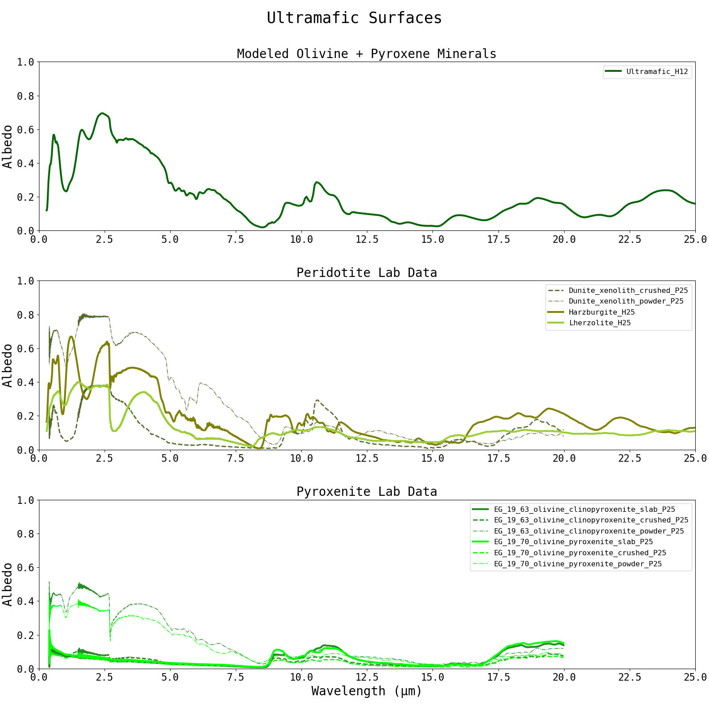

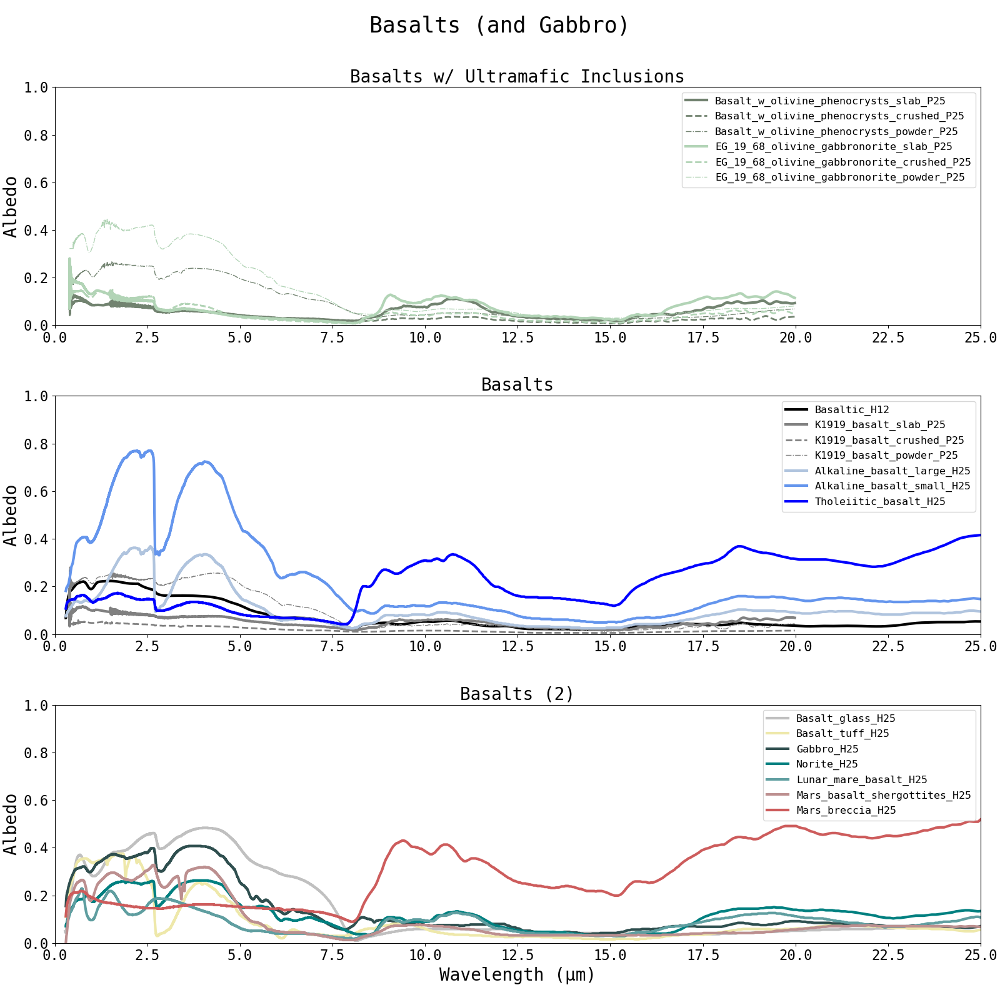

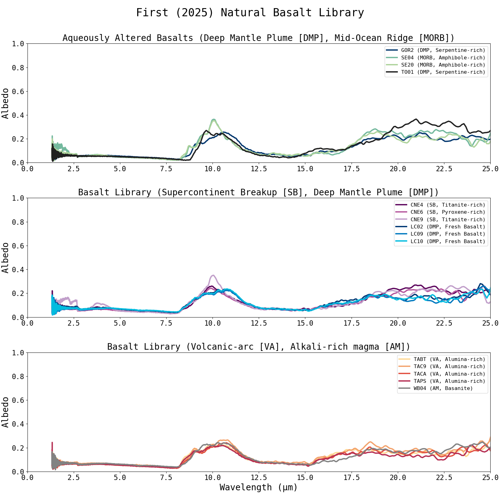

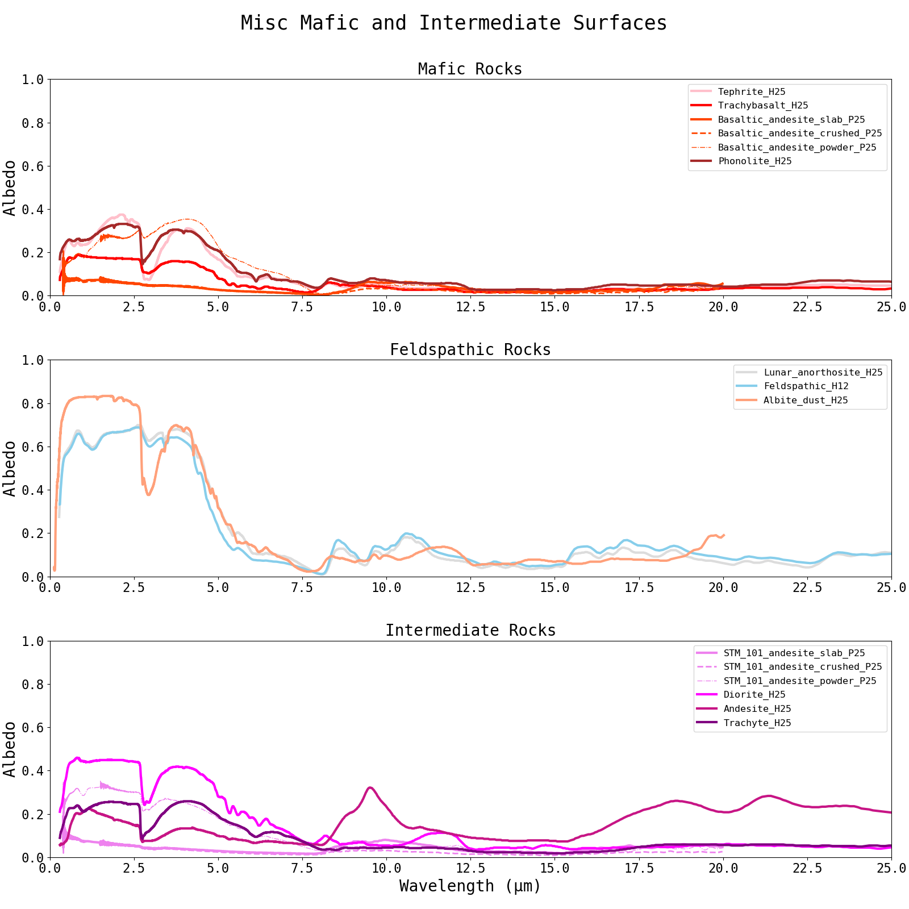

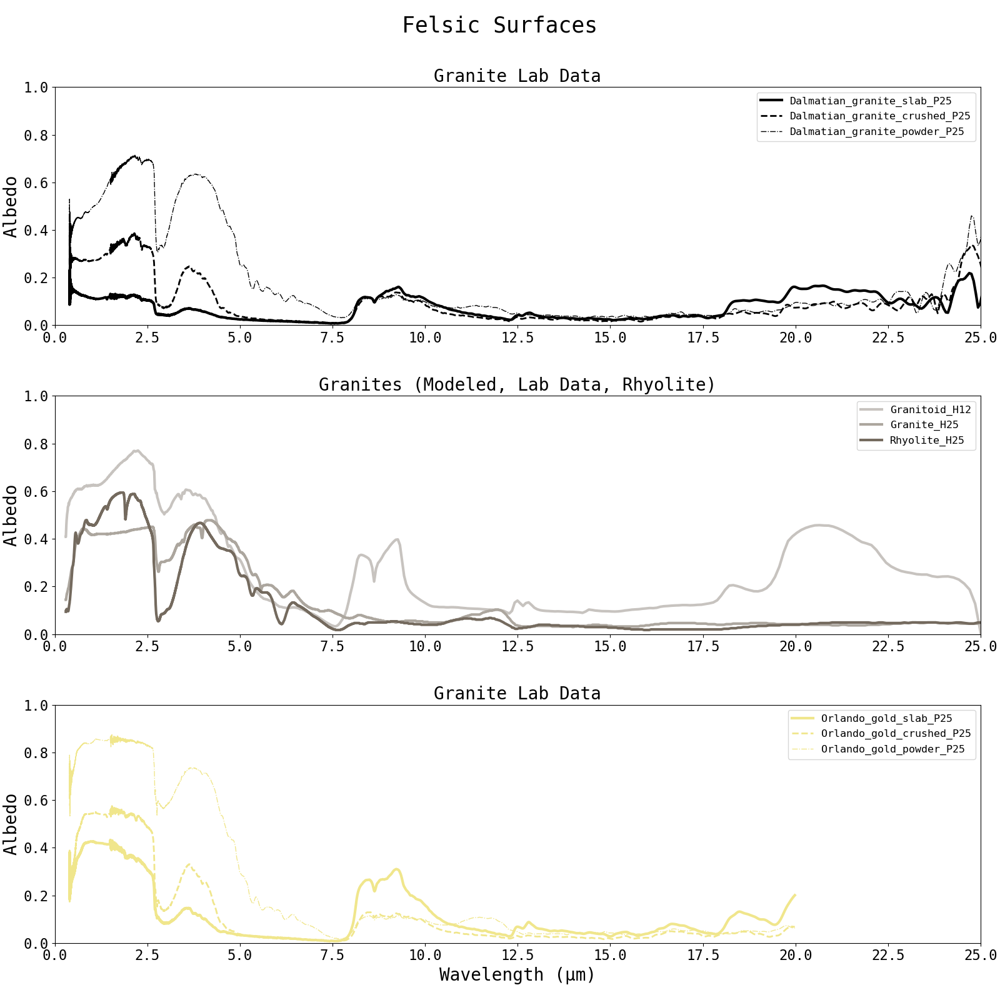

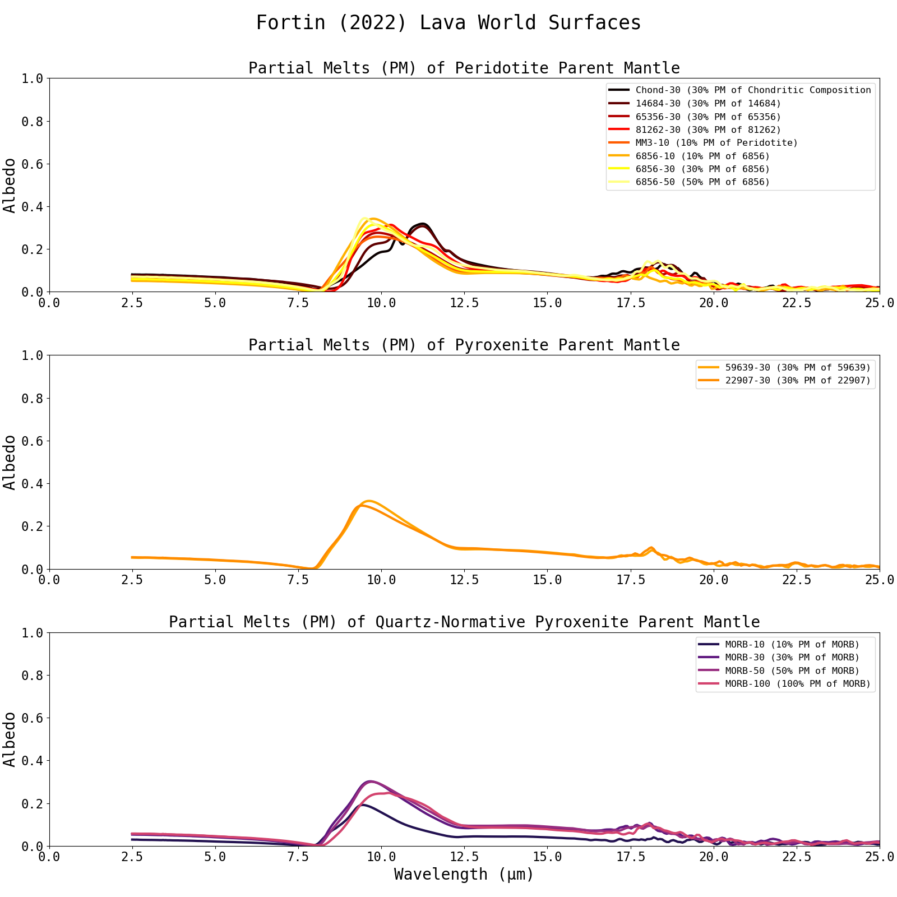

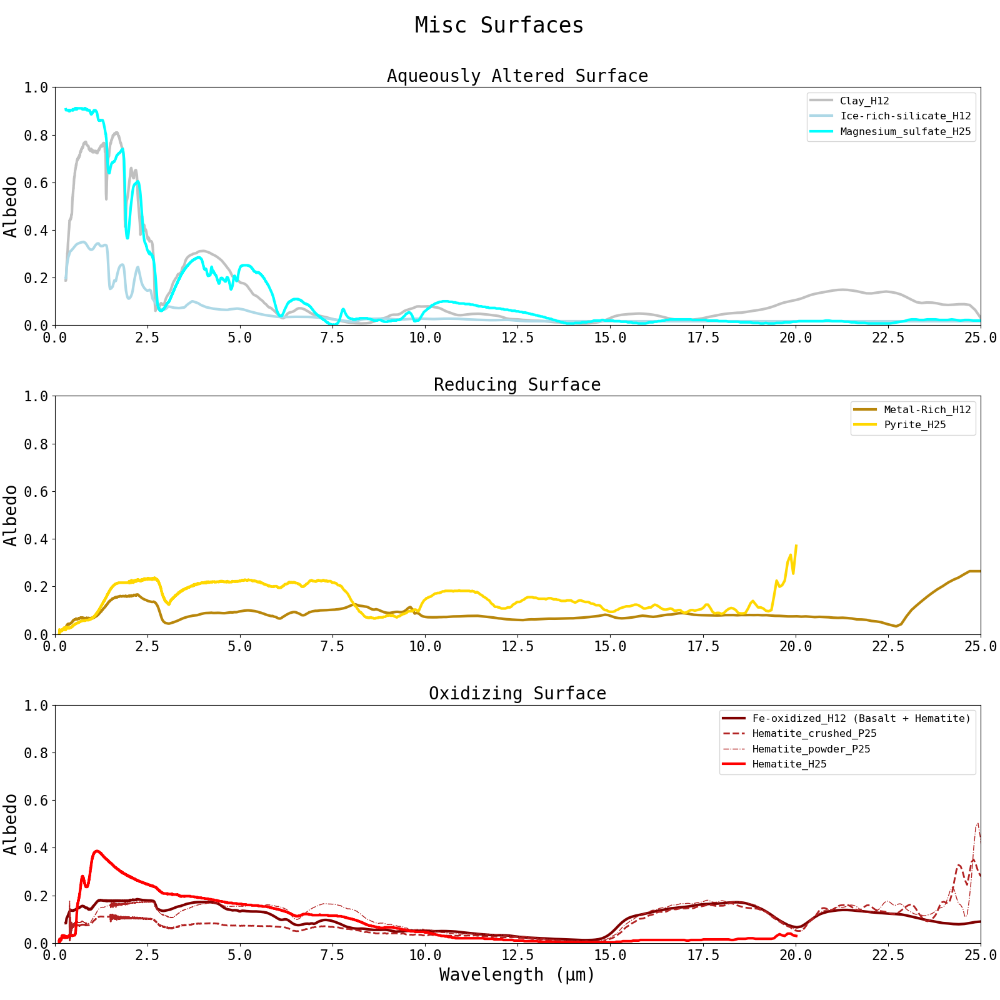

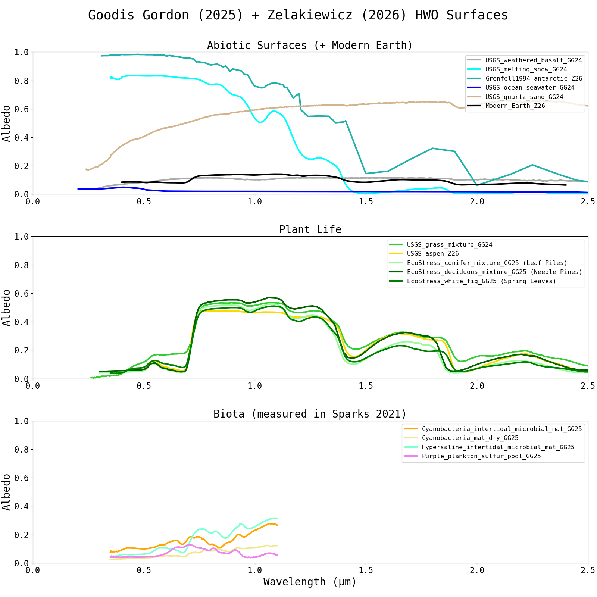

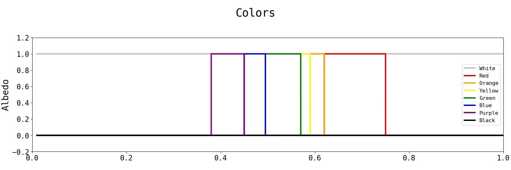

Surface Albedo References 
___________________________

As of POSEIDON v1.4, a fresh install of POSEIDON comes with a surface_reflectivies folder 
in the inputs folder. This folder contains the pre-included surface albedos (as .txt files) 
from the following source, where all txt files can be found collected `here <https://github.com/MartianColonist/POSEIDON/tree/dev_bugfix/POSEIDON/reference_data/surface_reflectivities_txt_files/>`_. 
The last portion of the albedo name signifies its source (i.e., _H12 = Hu 2012)

All albedos presented in the database are in the form directional-hemispherical reflectances
(with the exception of albedos from Goodis Gordon (2025) and Zelakiewicz (2026), see Table A7 and their papers). 

Users can simply add their own lab data to use with POSEIDON: just generate a txt file with the first column being 
wavelength, second column being albedo, and place it in the 'surface_reflectivities' folder. 
POSEIDON will automatically detect whether or not their is a txt file with the name matching 
that of the albedo defined in the 'surface_components' list in model initialization. 

We recommend that users try to ensure that their data is in the form of directional-hemispherical 
reflectance (for more details, see Appendix A in Mullens et al (2026)).

**When using any albedos in a publication, please be sure to cite the publication the 
data was collected in, as well as relevant publications for original laboratory measurements.**

H12, GG25, H25, and Z26 collected and/or reformatted previously published laboratory data. 

F22, F25, P25 performed and reported newly measured laboratory data. 

0. Mullens (2026), which compiled the original database. 

1. `Hu (2012) [H12] <https://ui.adsabs.harvard.edu/abs/2012ApJ...752....7H/abstract>`_ 
(Txt files found `here <https://github.com/MartianColonist/POSEIDON/tree/dev_bugfix/POSEIDON/reference_data/surface_reflectivities_txt_files/Hu2012-H12>`_) 

:math:`\hookrightarrow` Note: H12 sourced data from `Wyatt et al. 2011 <https://ui.adsabs.harvard.edu/abs/2001JGR...10614711W/abstract>`_ for basalt, `Cheek et al. 2009 <https://ui.adsabs.harvard.edu/abs/2009LPI....40.1928C/abstract>`_ for feldspatchic, and the `USGS Spectral Library <https://www.usgs.gov/labs/spectroscopy-lab/usgs-spectral-library>`_ for all other albedos.

2. `Fortin (2022) [F22] <https://ui.adsabs.harvard.edu/abs/2022MNRAS.516.4569F/abstract>`_
(Txt files found `here <https://github.com/MartianColonist/POSEIDON/tree/dev_bugfix/POSEIDON/reference_data/surface_reflectivities_txt_files/Fortin2022-F22>`_)

3. `First (2025) [F25] <https://ui.adsabs.harvard.edu/abs/2025NatAs...9..370F/abstract>`_
(Txt files found `here <https://github.com/MartianColonist/POSEIDON/tree/dev_bugfix/POSEIDON/reference_data/surface_reflectivities_txt_files/First2025-F25>`_)

4. `Goodis Gordon (2025) [G25] <https://ui.adsabs.harvard.edu/abs/2025ApJ...983..168G/abstract>`_
(Txt files found `here <https://github.com/MartianColonist/POSEIDON/tree/dev_bugfix/POSEIDON/reference_data/surface_reflectivities_txt_files/GoodisGordon2025-GG25>`_)

:math:`\hookrightarrow` Note: GG25 sourced data from `NASA JPL ECOSTRESS Spectral Library <https://speclib.jpl.nasa.gov/>`_, `USGS Spectral Library <https://www.usgs.gov/labs/spectroscopy-lab/usgs-spectral-library>`_, and microbial mats from `Sparks et al. (2021) <https://ui.adsabs.harvard.edu/abs/2021AsBio..21..219S/abstract>`_ (mats housed at NASA Ames Research Center).
See `Table linked here <../_static/surfaces_pdfs/H25-GG25-ReferenceNumbers.pdf>`_ for specific USGS and ECOSTRESS reference numbers.

5. `Hammond (2025) [H25] <https://ui.adsabs.harvard.edu/abs/2025ApJ...978L..40H/abstract>`_
(Txt files found `here <https://github.com/MartianColonist/POSEIDON/tree/dev_bugfix/POSEIDON/reference_data/surface_reflectivities_txt_files/Hammond2025-H25>`_ )

:math:`\hookrightarrow` Note: H25 sourced data fomr `RELAB Spectral Database <https://sites.brown.edu/relab/relab-spectral-database/>`_. See `Table linked here <../_static/surfaces_pdfs/H25-GG25-ReferenceNumbers.pdf>`_ for specific RELAB reference numbers.

6. `Paragas (2025) [P25] <https://ui.adsabs.harvard.edu/abs/2025ApJ...981..130P/abstract>`_
(Txt files found `here <https://github.com/MartianColonist/POSEIDON/tree/dev_bugfix/POSEIDON/reference_data/surface_reflectivities_txt_files/Paragas2025-P25>`_)

7. `Zelakiewicz (2026) [Z26] <https://ui.adsabs.harvard.edu/abs/2026arXiv260325694Z/abstract>`_
(Txt files found `here <https://github.com/MartianColonist/POSEIDON/tree/dev_bugfix/POSEIDON/reference_data/surface_reflectivities_txt_files/Zelakiewicz2026-Z26>`_)

:math:`\hookrightarrow` Note: Z26 sourced data from `USGS Spectral Library <https://www.usgs.gov/labs/spectroscopy-lab/usgs-spectral-library>`_, and antartic spectrum from `Grenfell et al. (1994) <https://agupubs.onlinelibrary.wiley.com/doi/10.1029/94JD01484>`_. See Table 2 in Z26 paper for specific USGS reference numbers.

8. Miscellaneous (i.e., colors) txt files found `here <https://github.com/MartianColonist/POSEIDON/tree/Mie-HotFix-w-Surfaces/POSEIDON/reference_data/surface_reflectivities_txt_files/Misc>`_ 

For in-depth tabulations of the albedo data included in the database, see Tables A4-7: 

.. raw:: html

    <object data="../_static/surfaces_pdfs/TablesA4-7.pdf" type="application/pdf" width="100%" height="600px">
        
<i>It appears you don't have a PDF plugin for this browser.
        No biggie... you can view the pdf via the link above.</i></a>

    </object>

Specific USGS, ECOSTRESS, and RELAB reference numbers for GG25 and H25 can be found here: 

.. raw:: html

    <object data="../_static/surfaces_pdfs/H25-GG25-ReferenceNumbers.pdf" type="application/pdf" width="100%" height="600px">
        
<i>It appears you don't have a PDF plugin for this browser.
        No biggie... you can view the pdf via the link above.</i></a>

    </object>

Geology Supplemental Material 
___________________________
Many of the albedos curated in the database are linked to specific minerals and rocks.

In order to foster future collaboration between geologists and exoplanet scientists, 
in the appendix of Mullens et al 2026 (the POSEIDON v1.4 paper) there are 
supplemental tables developed to elucidate the albedos included in this database. 
If unfamiliar with different rocks and minerals, we reccomend users to read these tables. 
The full list of tables can be found `here <../_static/surfaces_pdfs/Mullens2026_appendix.pdf>`_

For a primer on relevant geology terms and their connection to exoplanet science, see 
Table A1:

.. raw:: html

    <object data="../_static/surfaces_pdfs/TableA1.pdf" type="application/pdf" width="100%" height="600px">
        
<i>It appears you don't have a PDF plugin for this browser.
        No biggie... you can view the pdf via the link above.</i></a>

    </object>

For geological categories, which includes definitions and the Solar System context of 
rocks and minerals in the database, see Table A2:

.. raw:: html

    <object data="../_static/surfaces_pdfs/TableA2.pdf" type="application/pdf" width="100%" height="600px">
        
<i>It appears you don't have a PDF plugin for this browser.
        No biggie... you can view the pdf via the link above.</i></a>

    </object>

For broad surface type categories, which we use here to organize the albedos in our 
opacity previews, and potential considerations for interpretation if detected, see 
Table A3:

.. raw:: html

    <object data="../_static/surfaces_pdfs/TableA3.pdf" type="application/pdf" width="100%" height="600px">
        
<i>It appears you don't have a PDF plugin for this browser.
        No biggie... you can view the pdf via the link above.</i></a>

    </object>

Additional Resources 
___________________________

These are additional figures that can be used, alongside the Appendix tables, to better understand 
entries in the surface albedo database. 

Mineral composition of igenous rocks

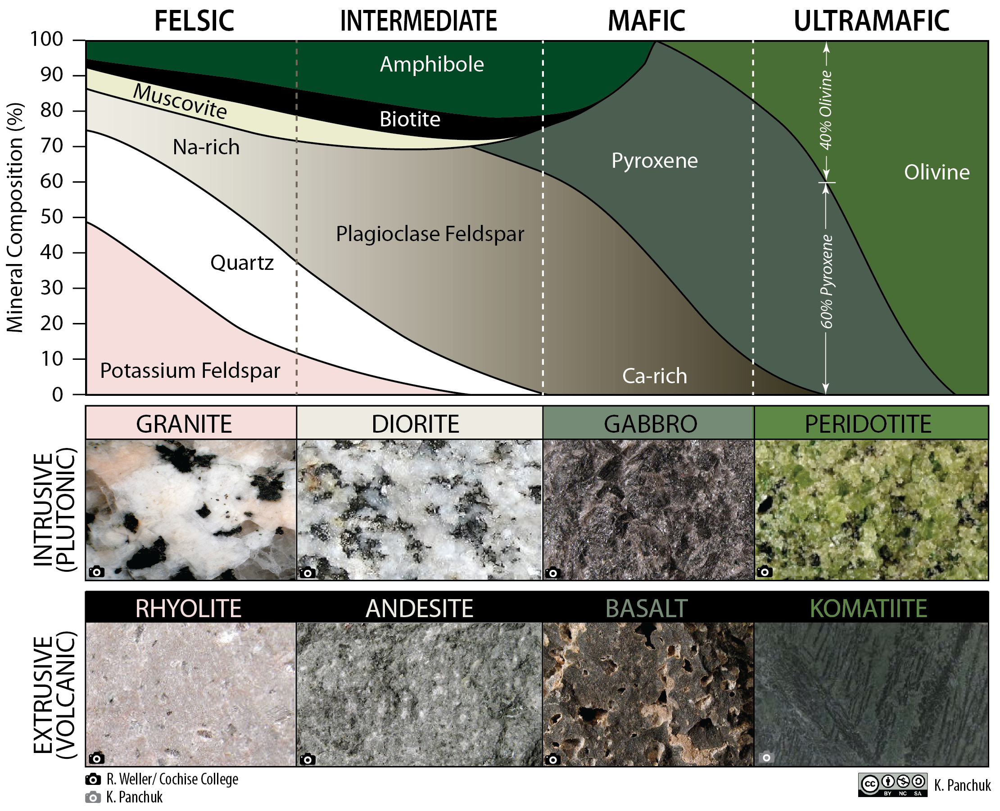

:math:`\hookrightarrow` sourced from `here <https://pressbooks.bccampus.ca/geoclone/chapter/7-3-classification-of-igneous-rocks-2/>`_ 

Total-Alkali Silica diagram 

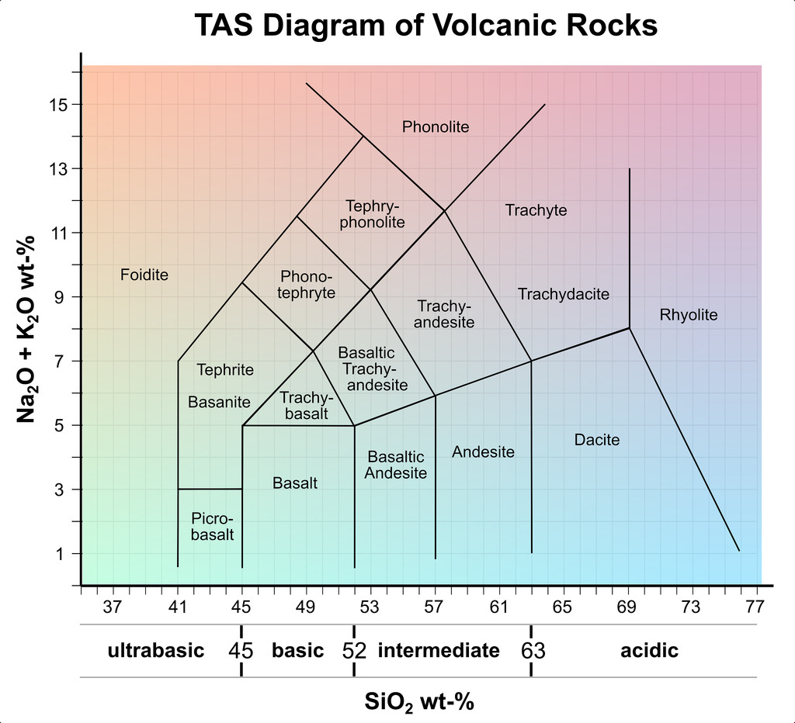

:math:`\hookrightarrow` sourced from `here <https://www.mindat.org/glossary/tas_classification>`_ 
