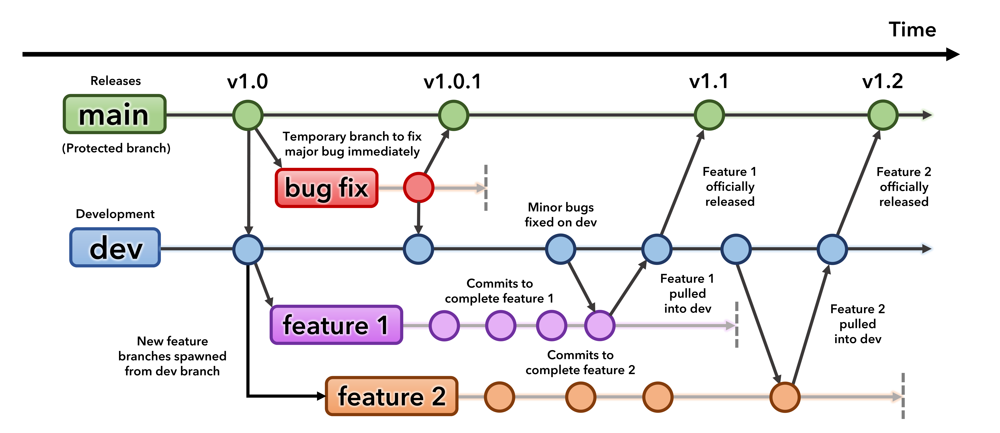

Contributing to POSEIDON
========================

Interested in contributing to POSEIDON? Welcome, we're excited to have you onboard!

If you'd like to make us aware of a bug, or request a new feature, the 
best option is to `open an issue <https://github.com/MartianColonist/POSEIDON/issues>`_
on GitHub.

To become more actively involved, feel free to browse the issues page and decide
whether you would like to work on a bug or new feature (or even better, add
a new automated test). If you're planning to work on a major new feature, we'd 
encourage you to reach our to the lead developer to give a heads-up: 
ryanjamc@umich.edu

.. note::
   We generally recommend using `VS Code <https://code.visualstudio.com/>`_ if
   this is your first time contributing to an open source project.

   VS Code provides a friendly interface to edit code, make git commits, send 
   pull requests, and more, all without needing to use git terminal commands.

POSEIDON uses the following development process (inspired by a graphic from 
Natasha Batalha):

When you first install POSEIDON, you'll be on the :code:`main` branch. The main
branch contains the current official release of the code.

All major developments happen on the :code:`dev` branch, where new versions of 
POSEIDON are developed and tested before being merged into :code:`main`.

The one exception is fixes for any major bugs, for which a temporary branch is
created and merged into main.

To work on a new feature, you'll first want to switch from :code:`main` to 
:code:`dev`. You can then create a branch off :code:`dev` called something like 
:code:`tremble_at_my_amazing_new_feature`. While you code, please make regular 
commits as you flesh out the feature. Once you're done, open a `Pull Request 
<https://github.com/MartianColonist/POSEIDON/pulls>`_ on GitHub to request
merging your new feature into :code:`dev`. This will trigger an automatic suite
of tests to verify that your new feature didn't accidentally break something.

VS Code has a `handy guide <https://code.visualstudio.com/docs/sourcecontrol/overview>`_
that covers how to handle git branches, make commits, and more.

