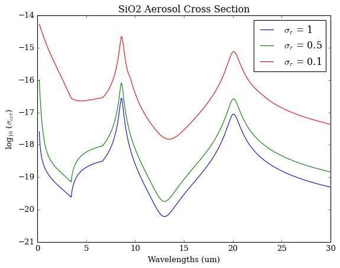

Opacity Database
================

Molecular, atomic, and aerosol opacities are a required input to any radiative 
transfer code. POSEIDON's opacity database includes high-resolution 
(:math:`R \sim 10^6`) line-by-line absorption cross sections and continuum 
absorption processes, alongside Mie scattering extinction cross sections, 
single scattering albedos, and asymmetry parameters.

Line-by-line Cross Sections
___________________________

POSEIDON v1.2 includes a comprehensive update to the opacity database to reflect 
recent theoretical and experimental advances:

* New line lists.
* Updated :math:`\mathrm{H_2}` + :math:`\mathrm{He}` broadening.
* Improved line position accuracy for high-resolution analyses (i.e. ExoMol's MARVEL procedure).
* UV-Visible wavelength coverage (down to :math:`0.2 \, \mathrm{\mu m}`, where available).

Note: POSEIDON v1.3 uses the same opacity database as v1.2.

The current line-by-line opacity sources included in POSEIDON are summarised below:

.. list-table::
   :widths: 20 20 20 20 20 20
   :header-rows: 1

   * - Species
     - Line List
       
       (Version)
     - Reference
     - Broadening
     - Updates vs. 
     
       POSEIDON 1.0
     - Plot

       (Click)

   *  - :math:`\mathrm{\textbf{Common}}`
        
        :math:`\mathrm{\textbf{Species}}`
      - 
      - 
      - 
      -
      - 

   * - :math:`\mathrm{H_2O}`
     - `POKAZATEL <https://www.exomol.com/data/molecules/H2O/1H2-16O/POKAZATEL/>`_
       
       (2023-06-21)
     - `Polyansky et al. <https://ui.adsabs.harvard.edu/abs/2018MNRAS.480.2597P/abstract>`_

       `(2018) <https://ui.adsabs.harvard.edu/abs/2018MNRAS.480.2597P/abstract>`_
     - :math:`\mathrm{H_2}` + :math:`\mathrm{He}`
     - MARVELised 
     - 
       .. image:: ../_static/opacity_previews/gases/H2O.png
          :width: 50
          :align: center

   * - :math:`\mathrm{CO_2}`
     - `UCL-4000 <https://www.exomol.com/data/molecules/CO2/12C-16O2/UCL-4000/>`_
       
       (2020-06-30)
     - `Yurchenko et al. <https://ui.adsabs.harvard.edu/abs/2020MNRAS.496.5282Y/abstract>`_

       `(2020) <https://ui.adsabs.harvard.edu/abs/2020MNRAS.496.5282Y/abstract>`_
     - :math:`\mathrm{H_2}` + :math:`\mathrm{He}`
     - New Line List
     - 
       .. image:: ../_static/opacity_previews/gases/CO2.png
          :width: 50
          :align: center

   * - :math:`\mathrm{CH_4}`
     - `MM <https://www.exomol.com/data/molecules/CH4/12C-1H4/MM/>`_
       
       (2024-01-13)
     - `Yurchenko et al. <https://ui.adsabs.harvard.edu/abs/2024MNRAS.528.3719Y/abstract>`_

       `(2024) <https://ui.adsabs.harvard.edu/abs/2024MNRAS.528.3719Y/abstract>`_
     - :math:`\mathrm{H_2}` + :math:`\mathrm{He}`
     - New Line List
     - 
       .. image:: ../_static/opacity_previews/gases/CH4.png
          :width: 50
          :align: center

   * - :math:`\mathrm{CO}`
     - `Li2015 <https://www.exomol.com/data/molecules/CO/12C-16O/Li2015/>`_
       
       (2017-01-31)
     - `Li et al. <https://ui.adsabs.harvard.edu/abs/2015ApJS..216...15L/abstract>`_

       `(2015) <https://ui.adsabs.harvard.edu/abs/2015ApJS..216...15L/abstract>`_
     - :math:`\mathrm{H_2}` + :math:`\mathrm{He}`
     - 6 Isotopes*
     - 
       .. image:: ../_static/opacity_previews/gases/CO.png
          :width: 50
          :align: center

   * - :math:`\mathrm{Na}`
     - `VALD3 <https://vald.astro.uu.se/~vald/>`_
     - `Ryabchikova et al. <https://ui.adsabs.harvard.edu/abs/2015PhyS...90e4005R/abstract>`_

       `(2015) <https://ui.adsabs.harvard.edu/abs/2015PhyS...90e4005R/abstract>`_
     - :math:`\mathrm{H_2}` + :math:`\mathrm{He}`
     - Air Wave. to

       Vacuum
     - 
       .. image:: ../_static/opacity_previews/gases/Na.png
          :width: 50
          :align: center

   * - :math:`\mathrm{K}`
     - `VALD3 <https://vald.astro.uu.se/~vald/>`_
     - `Ryabchikova et al. <https://ui.adsabs.harvard.edu/abs/2015PhyS...90e4005R/abstract>`_

       `(2015) <https://ui.adsabs.harvard.edu/abs/2015PhyS...90e4005R/abstract>`_
     - :math:`\mathrm{H_2}` + :math:`\mathrm{He}`
     - Air Wave. to

       Vacuum
     - 
       .. image:: ../_static/opacity_previews/gases/K.png
          :width: 50
          :align: center

   * - :math:`\mathrm{NH_3}`
     - `CoYuTe <https://www.exomol.com/data/molecules/NH3/14N-1H3/CoYuTe/>`_
       
       (2020-07-30)
     - `Coles et al. <https://ui.adsabs.harvard.edu/abs/2019MNRAS.490.4638C/abstract>`_

       `(2019) <https://ui.adsabs.harvard.edu/abs/2019MNRAS.490.4638C/abstract>`_
     - :math:`\mathrm{H_2}` + :math:`\mathrm{He}`
     - MARVELised 
     - 
       .. image:: ../_static/opacity_previews/gases/NH3.png
          :width: 50
          :align: center
  
   * - :math:`\mathrm{HCN}`
     - `Harris <https://www.exomol.com/data/molecules/HCN/1H-12C-14N/Harris/>`_
       
       (2016-12-05)
     - `Barber et al. <https://ui.adsabs.harvard.edu/abs/2014MNRAS.437.1828B/abstract>`_

       `(2014) <https://ui.adsabs.harvard.edu/abs/2014MNRAS.437.1828B/abstract>`_
     - :math:`\mathrm{H_2}` + :math:`\mathrm{He}`
     - No Change
     - 
       .. image:: ../_static/opacity_previews/gases/HCN.png
          :width: 50
          :align: center

   * - :math:`\mathrm{SO_2}`
     - `ExoAmes <https://www.exomol.com/data/molecules/SO2/32S-16O2/ExoAmes/>`_
       
       (2017-01-31)
     - `Underwood et al. <https://ui.adsabs.harvard.edu/abs/2016MNRAS.459.3890U/abstract>`_

       `(2016) <https://ui.adsabs.harvard.edu/abs/2016MNRAS.459.3890U/abstract>`_
     - :math:`\mathrm{H_2}` + :math:`\mathrm{He}`
     - MARVELised
     - 
       .. image:: ../_static/opacity_previews/gases/SO2.png
          :width: 50
          :align: center

   * - :math:`\mathrm{H_2 S}`
     - `AYT2 <https://www.exomol.com/data/molecules/H2S/1H2-32S/AYT2/>`_
       
       (2022-09-18)
     - `Azzam et al. <https://ui.adsabs.harvard.edu/abs/2016MNRAS.460.4063A/abstract>`_

       `(2016) <https://ui.adsabs.harvard.edu/abs/2016MNRAS.460.4063A/abstract>`_
     - :math:`\mathrm{H_2}` + :math:`\mathrm{He}`
     - Air Broad to 

       :math:`\mathrm{H_2}` + :math:`\mathrm{He}`
     - 
       .. image:: ../_static/opacity_previews/gases/H2S.png
          :width: 50
          :align: center

   * - :math:`\mathrm{PH_3}`
     - `SAlTY <https://www.exomol.com/data/molecules/PH3/31P-1H3/SAlTY/>`_
       
       (2017-01-31)
     - `Sousa-Silva et al. <https://ui.adsabs.harvard.edu/abs/2015MNRAS.446.2337S/abstract>`_

       `(2014) <https://ui.adsabs.harvard.edu/abs/2015MNRAS.446.2337S/abstract>`_
     - :math:`\mathrm{H_2}` + :math:`\mathrm{He}`
     - No Change
     - 
       .. image:: ../_static/opacity_previews/gases/PH3.png
          :width: 50
          :align: center

   * - :math:`\mathrm{C_2 H_2}`
     - `aCeTY <https://www.exomol.com/data/molecules/C2H2/12C2-1H2/aCeTY/>`_
       
       (2022-09-18)
     - `Chubb et al. <https://ui.adsabs.harvard.edu/abs/2020MNRAS.493.1531C/abstract>`_

       `(2020) <https://ui.adsabs.harvard.edu/abs/2020MNRAS.493.1531C/abstract>`_
     - :math:`\mathrm{H_2}` + :math:`\mathrm{He}`
     - New Line List
     - 
       .. image:: ../_static/opacity_previews/gases/C2H2.png
          :width: 50
          :align: center

   *  - :math:`\mathrm{\textbf{Metal}}`

        :math:`\mathrm{\textbf{Oxides}}`
      - 
      - 
      - 
      -
      - 

   * - :math:`\mathrm{TiO}`
     - `Toto <https://www.exomol.com/data/molecules/TiO/49Ti-16O/Toto/>`_
       
       (2024-05-09)
     - `McKemmish et al. <https://ui.adsabs.harvard.edu/abs/2019MNRAS.488.2836M/abstract>`_

       `(2019) <https://ui.adsabs.harvard.edu/abs/2019MNRAS.488.2836M/abstract>`_
     - :math:`\mathrm{H_2}` + :math:`\mathrm{He}`
     - MARVELised 
      
       SB'07 Broad to 

       :math:`\mathrm{H_2}` + :math:`\mathrm{He}`
     - 
       .. image:: ../_static/opacity_previews/gases/TiO.png
          :width: 50
          :align: center

   * - :math:`\mathrm{VO}`
     - `VOMYT <https://www.exomol.com/data/molecules/VO/51V-16O/VOMYT/>`_
       
       (2016-07-26)
     - `McKemmish et al. <https://ui.adsabs.harvard.edu/abs/2016MNRAS.463..771M/abstract>`_

       `(2016) <https://ui.adsabs.harvard.edu/abs/2016MNRAS.463..771M/abstract>`_
     - :math:`\mathrm{H_2}` + :math:`\mathrm{He}`
     - SB'07 Broad to 

       :math:`\mathrm{H_2}` + :math:`\mathrm{He}`
     - 
       .. image:: ../_static/opacity_previews/gases/VO.png
          :width: 50
          :align: center

   * - :math:`\mathrm{AlO}`
     - `ATP <https://www.exomol.com/data/molecules/AlO/27Al-16O/ATP/>`_
       
       (2021-06-22)
     - `Patrascu et al. <https://ui.adsabs.harvard.edu/abs/2015MNRAS.449.3613P/abstract>`_

       `(2015) <https://ui.adsabs.harvard.edu/abs/2015MNRAS.449.3613P/abstract>`_
     - :math:`\mathrm{H_2}` + :math:`\mathrm{He}`
     - MARVELised 

       SB'07 Broad to 

       :math:`\mathrm{H_2}` + :math:`\mathrm{He}`
     - 
       .. image:: ../_static/opacity_previews/gases/AlO.png
          :width: 50
          :align: center

   * - :math:`\mathrm{SiO}`
     - `SiOUVenIR <https://www.exomol.com/data/molecules/SiO/28Si-16O/SiOUVenIR/>`_
       
       (2021-11-05)
     - `Yurchenko et al. <https://ui.adsabs.harvard.edu/abs/2022MNRAS.510..903Y/abstract>`_

       `(2022) <https://ui.adsabs.harvard.edu/abs/2022MNRAS.510..903Y/abstract>`_
     - :math:`\mathrm{H_2}` + :math:`\mathrm{He}`
     - New Line List

       SB'07 Broad to 

       :math:`\mathrm{H_2}` + :math:`\mathrm{He}`
     - 
       .. image:: ../_static/opacity_previews/gases/SiO.png
          :width: 50
          :align: center

   * - :math:`\mathrm{CaO}`
     - `VBATHY <https://www.exomol.com/data/molecules/CaO/40Ca-16O/VBATHY/>`_
       
       (2023-02-20)
     - `Yurchenko et al. <https://ui.adsabs.harvard.edu/abs/2016MNRAS.456.4524Y/abstract>`_

       `(2016) <https://ui.adsabs.harvard.edu/abs/2016MNRAS.456.4524Y/abstract>`_
     - :math:`\mathrm{H_2}` + :math:`\mathrm{He}`
     - SB'07 Broad to 

       :math:`\mathrm{H_2}` + :math:`\mathrm{He}`
     - 
       .. image:: ../_static/opacity_previews/gases/CaO.png
          :width: 50
          :align: center

   * - :math:`\mathrm{MgO}`
     - `LiTY <https://www.exomol.com/data/molecules/MgO/24Mg-16O/LiTY/>`_
       
       (2019-04-01)
     - `Li et al. <https://ui.adsabs.harvard.edu/abs/2019MNRAS.486.2351L/abstract>`_

       `(2019) <https://ui.adsabs.harvard.edu/abs/2019MNRAS.486.2351L/abstract>`_
     - :math:`\mathrm{H_2}` + :math:`\mathrm{He}`
     - **Added Species**
     - 
       .. image:: ../_static/opacity_previews/gases/MgO.png
          :width: 50
          :align: center

   * - :math:`\mathrm{NaO}`
     - `NaOUCMe <https://www.exomol.com/data/molecules/NaO/23Na-16O/NaOUCMe/>`_
       
       (2021-11-17)
     - `Mitev et al. <https://ui.adsabs.harvard.edu/abs/2022MNRAS.511.2349M/abstract>`_

       `(2022) <https://ui.adsabs.harvard.edu/abs/2022MNRAS.511.2349M/abstract>`_
     - `SB'07 <https://ui.adsabs.harvard.edu/abs/2007ApJS..168..140S/abstract>`_
     - **Added Species**
     - 
       .. image:: ../_static/opacity_previews/gases/NaO.png
          :width: 50
          :align: center

   * - :math:`\mathrm{LaO}`
     - `BDL <https://www.exomol.com/data/molecules/LaO/139La-16O/BDL/>`_
       
       (2023-09-23)
     - `Bernath et al. <https://ui.adsabs.harvard.edu/abs/2023ApJ...953..181B/abstract>`_

       `(2023) <https://ui.adsabs.harvard.edu/abs/2023ApJ...953..181B/abstract>`_
     - `SB'07 <https://ui.adsabs.harvard.edu/abs/2007ApJS..168..140S/abstract>`_
     - **Added Species**
     - 
       .. image:: ../_static/opacity_previews/gases/LaO.png
          :width: 50
          :align: center

   * - :math:`\mathrm{ZrO}`
     - `ZorrO <https://www.exomol.com/data/molecules/ZrO/90Zr-16O/ZorrO/>`_
       
       (2023-07-13)
     - `Perri et al. <https://ui.adsabs.harvard.edu/abs/2023MNRAS.524.4631P/abstract>`_

       `(2023) <https://ui.adsabs.harvard.edu/abs/2023MNRAS.524.4631P/abstract>`_
     - `SB'07 <https://ui.adsabs.harvard.edu/abs/2007ApJS..168..140S/abstract>`_
     - **Added Species**
     - 
       .. image:: ../_static/opacity_previews/gases/ZrO.png
          :width: 50
          :align: center

   * - :math:`\mathrm{SO}`
     - `SOLIS <https://www.exomol.com/data/molecules/SO/32S-16O/SOLIS/>`_
       
       (2023-09-14)
     - `Brady et al. <https://ui.adsabs.harvard.edu/abs/2024MNRAS.527.6675B/abstract>`_

       `(2024) <https://ui.adsabs.harvard.edu/abs/2024MNRAS.527.6675B/abstract>`_
     - Fixed 
     
       :math:`\gamma_L = 0.07`

       :math:`n_L = 0.5`
     - **Added Species**
     - 
       .. image:: ../_static/opacity_previews/gases/SO.png
          :width: 50
          :align: center

   * - :math:`\mathrm{NO}`
     - `XABC <https://www.exomol.com/data/molecules/NO/14N-16O/XABC/>`_
       
       (2021-04-22)
     - `Qu et al. <https://ui.adsabs.harvard.edu/abs/2021MNRAS.504.5768Q/abstract>`_

       `(2021) <https://ui.adsabs.harvard.edu/abs/2021MNRAS.504.5768Q/abstract>`_
     - Air 
     - New Line List
     - 
       .. image:: ../_static/opacity_previews/gases/NO.png
          :width: 50
          :align: center

   * - :math:`\mathrm{PO}`
     - `POPS <https://www.exomol.com/data/molecules/PO/31P-16O/POPS/>`_
       
       (2017-09-10)
     - `Qu et al. <https://ui.adsabs.harvard.edu/abs/2017MNRAS.472.3648P/abstract>`_

       `(2017) <https://ui.adsabs.harvard.edu/abs/2017MNRAS.472.3648P/abstract>`_
     - :math:`\mathrm{H_2}` + :math:`\mathrm{He}`
     - SB'07 Broad to 

       :math:`\mathrm{H_2}` + :math:`\mathrm{He}`
     - 
       .. image:: ../_static/opacity_previews/gases/PO.png
          :width: 50
          :align: center

   *  - :math:`\mathrm{\textbf{Metal}}`

        :math:`\mathrm{\textbf{Hydrides}}`
      - 
      - 
      - 
      -
      - 

   * - :math:`\mathrm{TiH}`
     - `MoLLIST <https://www.exomol.com/data/molecules/TiH/48Ti-1H/MoLLIST/>`_
       
       (2016-07-26)
     - `Bernath <https://ui.adsabs.harvard.edu/abs/2020JQSRT.24006687B/abstract>`_

       `(2020) <https://ui.adsabs.harvard.edu/abs/2020JQSRT.24006687B/abstract>`_
     - :math:`\mathrm{H_2}` + :math:`\mathrm{He}`
     - New Line List
      
       SB'07 Broad to 

       :math:`\mathrm{H_2}` + :math:`\mathrm{He}`
     - 
       .. image:: ../_static/opacity_previews/gases/TiH.png
          :width: 50
          :align: center

   * - :math:`\mathrm{CrH}`
     - `MoLLIST <https://www.exomol.com/data/molecules/CrH/52Cr-1H/MoLLIST/>`_
       
       (2016-07-26)
     - `Bernath <https://ui.adsabs.harvard.edu/abs/2020JQSRT.24006687B/abstract>`_

       `(2020) <https://ui.adsabs.harvard.edu/abs/2020JQSRT.24006687B/abstract>`_
     - :math:`\mathrm{H_2}` + :math:`\mathrm{He}`
     - New Line List
      
       SB'07 Broad to 

       :math:`\mathrm{H_2}` + :math:`\mathrm{He}`
     - 
       .. image:: ../_static/opacity_previews/gases/CrH.png
          :width: 50
          :align: center

   * - :math:`\mathrm{FeH}`
     - `MoLLIST <https://www.exomol.com/data/molecules/FeH/56Fe-1H/MoLLIST/>`_
       
       (2016-07-26)
     - `Bernath <https://ui.adsabs.harvard.edu/abs/2020JQSRT.24006687B/abstract>`_

       `(2020) <https://ui.adsabs.harvard.edu/abs/2020JQSRT.24006687B/abstract>`_
     - :math:`\mathrm{H_2}` + :math:`\mathrm{He}`
     - New Line List

       SB'07 Broad to 

       :math:`\mathrm{H_2}` + :math:`\mathrm{He}`
     - 
       .. image:: ../_static/opacity_previews/gases/FeH.png
          :width: 50
          :align: center

   * - :math:`\mathrm{ScH}`
     - `MoLLIST <https://www.exomol.com/data/molecules/ScH/45Sc-1H/LYT/>`_
       
       (2016-07-26)
     - `Lodi et al. <https://ui.adsabs.harvard.edu/abs/2015MolPh.113.1998L/abstract>`_

       `(2015) <https://ui.adsabs.harvard.edu/abs/2015MolPh.113.1998L/abstract>`_
     - :math:`\mathrm{H_2}` + :math:`\mathrm{He}`
     - SB'07 Broad to 

       :math:`\mathrm{H_2}` + :math:`\mathrm{He}`
     - 
       .. image:: ../_static/opacity_previews/gases/ScH.png
          :width: 50
          :align: center

   * - :math:`\mathrm{AlH}`
     - `AloHa <https://www.exomol.com/data/molecules/AlH/27Al-1H/AloHa/>`_
       
       (2016-07-26)
     - `Yurchenko et al. <https://ui.adsabs.harvard.edu/abs/2024MNRAS.527.9736Y/abstract>`_

       `(2023) <https://ui.adsabs.harvard.edu/abs/2024MNRAS.527.9736Y/abstract>`_
     - :math:`\mathrm{H_2}` + :math:`\mathrm{He}`
     - New Line List

       SB'07 Broad to 

       :math:`\mathrm{H_2}` + :math:`\mathrm{He}`
     - 
       .. image:: ../_static/opacity_previews/gases/AlH.png
          :width: 50
          :align: center

   * - :math:`\mathrm{SiH}`
     - `SiGHTLY <https://www.exomol.com/data/molecules/SiH/28Si-1H/SiGHTLY/>`_
       
       (2017-11-01)
     - `Yurchenko et al. <https://ui.adsabs.harvard.edu/abs/2018MNRAS.473.5324Y/abstract>`_

       `(2018) <https://ui.adsabs.harvard.edu/abs/2018MNRAS.473.5324Y/abstract>`_
     - :math:`\mathrm{H_2}` + :math:`\mathrm{He}`
     - SB'07 Broad to 

       :math:`\mathrm{H_2}` + :math:`\mathrm{He}`
     - 
       .. image:: ../_static/opacity_previews/gases/SiH.png
          :width: 50
          :align: center

   * - :math:`\mathrm{BeH}`
     - `Darby-Lewis <https://www.exomol.com/data/molecules/BeH/9Be-1H/Darby-Lewis/>`_
       
       (2018-02-12)
     - `Darby-Lewis et al. <https://ui.adsabs.harvard.edu/abs/2018JPhB...51r5701D/abstract>`_

       `(2018) <https://ui.adsabs.harvard.edu/abs/2018JPhB...51r5701D/abstract>`_
     - :math:`\mathrm{H_2}` + :math:`\mathrm{He}`
     - SB'07 Broad to 

       :math:`\mathrm{H_2}` + :math:`\mathrm{He}`
     - 
       .. image:: ../_static/opacity_previews/gases/BeH.png
          :width: 50
          :align: center

   * - :math:`\mathrm{CaH}`
     - `XAB <https://www.exomol.com/data/molecules/CaH/40Ca-1H/XAB/>`_
       
       (2022-02-11)
     - `Owens et al. <https://ui.adsabs.harvard.edu/abs/2022MNRAS.511.5448O/abstract>`_

       `(2022) <https://ui.adsabs.harvard.edu/abs/2022MNRAS.511.5448O/abstract>`_
     - :math:`\mathrm{H_2}` + :math:`\mathrm{He}`
     - New Line List

       SB'07 Broad to 

       :math:`\mathrm{H_2}` + :math:`\mathrm{He}`
     - 
       .. image:: ../_static/opacity_previews/gases/CaH.png
          :width: 50
          :align: center

   * - :math:`\mathrm{MgH}`
     - `XAB <https://www.exomol.com/data/molecules/MgH/24Mg-1H/XAB/>`_
       
       (2022-02-11)
     - `Owens et al. <https://ui.adsabs.harvard.edu/abs/2022MNRAS.511.5448O/abstract>`_

       `(2022) <https://ui.adsabs.harvard.edu/abs/2022MNRAS.511.5448O/abstract>`_
     - :math:`\mathrm{H_2}` + :math:`\mathrm{He}`
     - New Line List

       SB'07 Broad to 

       :math:`\mathrm{H_2}` + :math:`\mathrm{He}`
     - 
       .. image:: ../_static/opacity_previews/gases/MgH.png
          :width: 50
          :align: center

   * - :math:`\mathrm{LiH}`
     - `CLT <https://www.exomol.com/data/molecules/LiH/7Li-1H/CLT/>`_
       
       (2016-09-27)
     - `Coppola et al. <https://ui.adsabs.harvard.edu/abs/2011MNRAS.415..487C/abstract>`_

       `(2011) <https://ui.adsabs.harvard.edu/abs/2011MNRAS.415..487C/abstract>`_
     - :math:`\mathrm{H_2}` + :math:`\mathrm{He}`
     - SB'07 Broad to 

       :math:`\mathrm{H_2}` + :math:`\mathrm{He}`
     - 
       .. image:: ../_static/opacity_previews/gases/LiH.png
          :width: 50
          :align: center

   * - :math:`\mathrm{NaH}`
     - `Rivlin <https://www.exomol.com/data/molecules/NaH/23Na-1H/Rivlin/>`_
       
       (2016-09-27)
     - `Rivlin et al. <https://ui.adsabs.harvard.edu/abs/2015MNRAS.451..634R/abstract>`_

       `(2015) <https://ui.adsabs.harvard.edu/abs/2015MNRAS.451..634R/abstract>`_
     - :math:`\mathrm{H_2}` + :math:`\mathrm{He}`
     - SB'07 Broad to 

       :math:`\mathrm{H_2}` + :math:`\mathrm{He}`
     - 
       .. image:: ../_static/opacity_previews/gases/NaH.png
          :width: 50
          :align: center

   * - :math:`\mathrm{OH}`
     - `MoLLIST <https://www.exomol.com/data/molecules/OH/16O-1H/MoLLIST/>`_
       
       (2018-07-19)
     - `Bernath <https://ui.adsabs.harvard.edu/abs/2020JQSRT.24006687B/abstract>`_

       `(2020) <https://ui.adsabs.harvard.edu/abs/2020JQSRT.24006687B/abstract>`_
     - :math:`\mathrm{H_2}` + :math:`\mathrm{He}`
     - New Line List
     
       Air Broad to 

       :math:`\mathrm{H_2}` + :math:`\mathrm{He}`
     - 
       .. image:: ../_static/opacity_previews/gases/OH.png
          :width: 50
          :align: center

   * - :math:`\mathrm{OH^{+}}`
     - `MoLLIST <https://www.exomol.com/data/molecules/OH_p/16O-1H_p/MoLLIST/>`_
       
       (2022-07-13)
     - `Bernath <https://ui.adsabs.harvard.edu/abs/2020JQSRT.24006687B/abstract>`_

       `(2020) <https://ui.adsabs.harvard.edu/abs/2020JQSRT.24006687B/abstract>`_
     - :math:`\mathrm{H_2}` + :math:`\mathrm{He}`
     - **Added Species**
     - 
       .. image:: ../_static/opacity_previews/gases/OH+.png
          :width: 50
          :align: center

   * - :math:`\mathrm{CH}`
     - `MoLLIST <https://www.exomol.com/data/molecules/CH/12C-1H/MoLLIST/>`_
       
       (2019-02-14)
     - `Bernath <https://ui.adsabs.harvard.edu/abs/2020JQSRT.24006687B/abstract>`_

       `(2020) <https://ui.adsabs.harvard.edu/abs/2020JQSRT.24006687B/abstract>`_
     - :math:`\mathrm{H_2}` + :math:`\mathrm{He}`
     - New Line List

       SB'07 Broad to 

       :math:`\mathrm{H_2}` + :math:`\mathrm{He}`
     - 
       .. image:: ../_static/opacity_previews/gases/CH.png
          :width: 50
          :align: center

   * - :math:`\mathrm{NH}`
     - `kNigHt <https://www.exomol.com/data/molecules/NH/14N-1H/kNigHt/>`_
       
       (2024-03-01)
     - `Perri et al. <https://ui.adsabs.harvard.edu/abs/2024MNRAS.531.3023P/abstract>`_

       `(2024) <https://ui.adsabs.harvard.edu/abs/2024MNRAS.531.3023P/abstract>`_
     - :math:`\mathrm{H_2}` + :math:`\mathrm{He}`
     - New Line List

       SB'07 Broad to 

       :math:`\mathrm{H_2}` + :math:`\mathrm{He}`
     - 
       .. image:: ../_static/opacity_previews/gases/NH.png
          :width: 50
          :align: center
  
   * - :math:`\mathrm{SH}`
     - `GYT <https://www.exomol.com/data/molecules/SH/32S-1H/GYT/>`_
       
       (2019-08-01)
     - `Gorman et al. <https://ui.adsabs.harvard.edu/abs/2019MNRAS.490.1652G/abstract>`_

       `(2019) <https://ui.adsabs.harvard.edu/abs/2019MNRAS.490.1652G/abstract>`_
     - :math:`\mathrm{H_2}` + :math:`\mathrm{He}`
     - New Line List
     
       Air Broad to 

       :math:`\mathrm{H_2}` + :math:`\mathrm{He}`
     - 
       .. image:: ../_static/opacity_previews/gases/SH.png
          :width: 50
          :align: center

   *  - :math:`\mathrm{\textbf{Misc.}}`
      - 
      - 
      - 
      -
      - 

   * - :math:`\mathrm{OCS}`
     - `OYT8 <https://www.exomol.com/data/molecules/OCS/16O-12C-32S/OYT8/>`_
       
       (2024-04-25)
     - `Owens et al. <https://ui.adsabs.harvard.edu/abs/2024MNRAS.530.4004O/abstract>`_

       `(2024) <https://ui.adsabs.harvard.edu/abs/2024MNRAS.530.4004O/abstract>`_
     - :math:`\mathrm{H_2}` + :math:`\mathrm{He}`
     - **Added Species**
     - 
       .. image:: ../_static/opacity_previews/gases/OCS.png
          :width: 50
          :align: center

   * - :math:`\mathrm{PN}`
     - `PaiN <https://www.exomol.com/data/molecules/PN/31P-14N/PaiN/>`_
       
       (2024-05-05)
     - `Semenov et al.`

       `(2024)`
     - :math:`\mathrm{H_2}` + :math:`\mathrm{He}`
     - New Line List

       SB'07 Broad to 

       :math:`\mathrm{H_2}` + :math:`\mathrm{He}`
     - 
       .. image:: ../_static/opacity_previews/gases/PN.png
          :width: 50
          :align: center

   * - :math:`\mathrm{PS}`
     - `POPS <https://www.exomol.com/data/molecules/PS/31P-32S/POPS/>`_
       
       (2017-09-10)
     - `Prajapat et al. <https://ui.adsabs.harvard.edu/abs/2017MNRAS.472.3648P/abstract>`_

       `(2017) <https://ui.adsabs.harvard.edu/abs/2017MNRAS.472.3648P/abstract>`_
     - :math:`\mathrm{H_2}` + :math:`\mathrm{He}`
     - SB'07 Broad to 

       :math:`\mathrm{H_2}` + :math:`\mathrm{He}`
     - 
       .. image:: ../_static/opacity_previews/gases/PS.png
          :width: 50
          :align: center

   * - :math:`\mathrm{CS}`
     - `JnK <https://www.exomol.com/data/molecules/CS/12C-32S/JnK/>`_
       
       (2016-07-26)
     - `Paulose et al. <https://ui.adsabs.harvard.edu/abs/2015MNRAS.454.1931P/abstract>`_

       `(2015) <https://ui.adsabs.harvard.edu/abs/2015MNRAS.454.1931P/abstract>`_
     - :math:`\mathrm{H_2}` + :math:`\mathrm{He}`
     - **Added Species**
     - 
       .. image:: ../_static/opacity_previews/gases/CS.png
          :width: 50
          :align: center

   * - :math:`\mathrm{C_2}`
     - `8states <https://www.exomol.com/data/molecules/C2/12C2/8states/>`_
       
       (2020-06-28)
     - `Yurchenko et al. <https://ui.adsabs.harvard.edu/abs/2018MNRAS.480.3397Y/abstract>`_

       `(2018) <https://ui.adsabs.harvard.edu/abs/2018MNRAS.480.3397Y/abstract>`_
     - :math:`\mathrm{H_2}` + :math:`\mathrm{He}`
     - **Added Species**
     - 
       .. image:: ../_static/opacity_previews/gases/C2.png
          :width: 50
          :align: center

   * - :math:`\mathrm{CH_3}`
     - `AYYJ <https://www.exomol.com/data/molecules/CH3/12C-1H3/AYYJ/>`_
       
       (2019-05-01)
     - `Adam et al. <https://ui.adsabs.harvard.edu/abs/2019JPCA..123.4755A/abstract>`_

       `(2019) <https://ui.adsabs.harvard.edu/abs/2019JPCA..123.4755A/abstract>`_
     - Fixed 
     
       :math:`\gamma_L = 0.05`

       :math:`n_L = 0.5`
     - **Added Species**
     - 
       .. image:: ../_static/opacity_previews/gases/CH3.png
          :width: 50
          :align: center
    
   * - :math:`\mathrm{H_{3}^{+}}`
     - `MiZATeP <https://www.exomol.com/data/molecules/OH_p/16O-1H_p/MoLLIST/>`_
       
       (2017-03-30)
     - `Mizus et al. <https://ui.adsabs.harvard.edu/abs/2017MNRAS.468.1717M/abstract>`_

       `(2017) <https://ui.adsabs.harvard.edu/abs/2017MNRAS.468.1717M/abstract>`_
     - Fixed 
     
       :math:`\gamma_L = 0.07`

       :math:`n_L = 0.5`
     - No Change
     - 
       .. image:: ../_static/opacity_previews/gases/H3+.png
          :width: 50
          :align: center

   * - :math:`\mathrm{N_2 O}`
     - `HITEMP-2020 <https://hitran.org/hitemp/>`_
     - `Hargreaves et al. <https://ui.adsabs.harvard.edu/abs/2019JQSRT.232...35H/abstract>`_

       `(2019) <https://ui.adsabs.harvard.edu/abs/2019JQSRT.232...35H/abstract>`_
     - Air
     - New Line List
     - 
       .. image:: ../_static/opacity_previews/gases/N2O.png
          :width: 50
          :align: center

   * - :math:`\mathrm{NO_2}`
     - `HITEMP-2020 <https://hitran.org/hitemp/>`_
     - `Hargreaves et al. <https://ui.adsabs.harvard.edu/abs/2019JQSRT.232...35H/abstract>`_

       `(2019) <https://ui.adsabs.harvard.edu/abs/2019JQSRT.232...35H/abstract>`_
     - Air
     - New Line List
     - 
       .. image:: ../_static/opacity_previews/gases/NO2.png
          :width: 50
          :align: center

   *  - :math:`\mathrm{\textbf{HITRAN}}`

        :math:`\mathrm{\textbf{(Low-T)}}`
      - 
      - 
      - 
      -
      - 

   * - :math:`\mathrm{C_2 H_4}`
     - `HITRAN-2020 <https://hitran.org/lbl/3?90=on>`_
     - `Gordon et al. <https://ui.adsabs.harvard.edu/abs/2022JQSRT.27707949G/abstract>`_

       `(2022) <https://ui.adsabs.harvard.edu/abs/2022JQSRT.27707949G/abstract>`_
     - Air
     - **Added Species**
     - 
       .. image:: ../_static/opacity_previews/gases/C2H4.png
          :width: 50
          :align: center

   * - :math:`\mathrm{C_2 H_6}`
     - `HITRAN-2020 <https://hitran.org/lbl/3?78=on>`_
     - `Gordon et al. <https://ui.adsabs.harvard.edu/abs/2022JQSRT.27707949G/abstract>`_

       `(2022) <https://ui.adsabs.harvard.edu/abs/2022JQSRT.27707949G/abstract>`_
     - Air
     - **Added Species**
     - 
       .. image:: ../_static/opacity_previews/gases/C2H6.png
          :width: 50
          :align: center

   * - :math:`\mathrm{CH_3 CN}`
     - `HITRAN-2020 <https://hitran.org/lbl/3?95=on>`_
     - `Gordon et al. <https://ui.adsabs.harvard.edu/abs/2022JQSRT.27707949G/abstract>`_

       `(2022) <https://ui.adsabs.harvard.edu/abs/2022JQSRT.27707949G/abstract>`_
     - Air
     - **Added Species**
     - 
       .. image:: ../_static/opacity_previews/gases/CH3CN.png
          :width: 50
          :align: center

   * - :math:`\mathrm{CH_3 OH}`
     - `HITRAN-2020 <https://hitran.org/lbl/3?92=onn>`_
     - `Gordon et al. <https://ui.adsabs.harvard.edu/abs/2022JQSRT.27707949G/abstract>`_

       `(2022) <https://ui.adsabs.harvard.edu/abs/2022JQSRT.27707949G/abstract>`_
     - Air
     - **Added Species**
     - 
       .. image:: ../_static/opacity_previews/gases/CH3OH.png
          :width: 50
          :align: center

   * - :math:`\mathrm{CH_3 Cl}`
     - `HITRAN-2020 <https://hitran.org/lbl/3?92=onn>`_
     - `Gordon et al. <https://ui.adsabs.harvard.edu/abs/2022JQSRT.27707949G/abstract>`_

       `(2022) <https://ui.adsabs.harvard.edu/abs/2022JQSRT.27707949G/abstract>`_
     - Air
     - **Added Species**
     - 
       .. image:: ../_static/opacity_previews/gases/CH3Cl.png
          :width: 50
          :align: center

   * - :math:`\mathrm{GeH_4}`
     - `HITRAN-2020 <https://hitran.org/lbl/3?139=on>`_
     - `Gordon et al. <https://ui.adsabs.harvard.edu/abs/2022JQSRT.27707949G/abstract>`_

       `(2022) <https://ui.adsabs.harvard.edu/abs/2022JQSRT.27707949G/abstract>`_
     - Air
     - **Added Species**
     - 
       .. image:: ../_static/opacity_previews/gases/GeH4.png
          :width: 50
          :align: center

   * - :math:`\mathrm{CS_2}`
     - `HITRAN-2020 <https://hitran.org/lbl/3?131=on>`_
     - `Gordon et al. <https://ui.adsabs.harvard.edu/abs/2022JQSRT.27707949G/abstract>`_

       `(2022) <https://ui.adsabs.harvard.edu/abs/2022JQSRT.27707949G/abstract>`_
     - Air
     - **Added Species**
     - 
       .. image:: ../_static/opacity_previews/gases/CS2.png
          :width: 50
          :align: center

   * - :math:`\mathrm{O_2}`
     - `HITRAN-2020 <https://hitran.org/lbl/3?36=on>`_
     - `Gordon et al. <https://ui.adsabs.harvard.edu/abs/2022JQSRT.27707949G/abstract>`_

       `(2022) <https://ui.adsabs.harvard.edu/abs/2022JQSRT.27707949G/abstract>`_
     - Air
     - New Line List
     - 
       .. image:: ../_static/opacity_previews/gases/O2.png
          :width: 50
          :align: center

   * - :math:`\mathrm{O_3}`
     - `HITRAN-2020 <https://hitran.org/lbl/3?16=on>`_

       Laboratory
     - `Gordon et al. <https://ui.adsabs.harvard.edu/abs/2022JQSRT.27707949G/abstract>`_

       `(2022) <https://ui.adsabs.harvard.edu/abs/2022JQSRT.27707949G/abstract>`_

       `Serdyuchenko et al. <https://ui.adsabs.harvard.edu/abs/2014AMT.....7..625S/abstract>`_

       `(2014) <https://ui.adsabs.harvard.edu/abs/2014AMT.....7..625S/abstract>`_
     - Air
     - New Line List
     - 
       .. image:: ../_static/opacity_previews/gases/O3.png
          :width: 50
          :align: center

   *  - :math:`\mathrm{\textbf{Atoms}}`

        :math:`\mathrm{\textbf{and Ions}}`
      - 
      - 
      - 
      -
      - 

   * - :math:`\mathrm{Al}`
     - `VALD3 <https://vald.astro.uu.se/~vald/>`_
     - `Ryabchikova et al. <https://ui.adsabs.harvard.edu/abs/2015PhyS...90e4005R/abstract>`_

       `(2015) <https://ui.adsabs.harvard.edu/abs/2015PhyS...90e4005R/abstract>`_
     - :math:`\mathrm{H_2}` + :math:`\mathrm{He}`
     - **Added Species**
     - 
       .. image:: ../_static/opacity_previews/gases/Al.png
          :width: 50
          :align: center

   * - :math:`\mathrm{Ba}`
     - `VALD3 <https://vald.astro.uu.se/~vald/>`_
     - `Ryabchikova et al. <https://ui.adsabs.harvard.edu/abs/2015PhyS...90e4005R/abstract>`_

       `(2015) <https://ui.adsabs.harvard.edu/abs/2015PhyS...90e4005R/abstract>`_
     - :math:`\mathrm{H_2}` + :math:`\mathrm{He}`
     - **Added Species**
     - 
       .. image:: ../_static/opacity_previews/gases/Ba.png
          :width: 50
          :align: center

   * - :math:`\mathrm{Ba^{+}}`
     - `VALD3 <https://vald.astro.uu.se/~vald/>`_
     - `Ryabchikova et al. <https://ui.adsabs.harvard.edu/abs/2015PhyS...90e4005R/abstract>`_

       `(2015) <https://ui.adsabs.harvard.edu/abs/2015PhyS...90e4005R/abstract>`_
     - :math:`\mathrm{H_2}` + :math:`\mathrm{He}`
     - **Added Species**
     - 
       .. image:: ../_static/opacity_previews/gases/Ba+.png
          :width: 50
          :align: center
  
   * - :math:`\mathrm{Ca}`
     - `VALD3 <https://vald.astro.uu.se/~vald/>`_
     - `Ryabchikova et al. <https://ui.adsabs.harvard.edu/abs/2015PhyS...90e4005R/abstract>`_

       `(2015) <https://ui.adsabs.harvard.edu/abs/2015PhyS...90e4005R/abstract>`_
     - :math:`\mathrm{H_2}` + :math:`\mathrm{He}`
     - Air Wave. to

       Vacuum
     - 
       .. image:: ../_static/opacity_previews/gases/Ca.png
          :width: 50
          :align: center

   * - :math:`\mathrm{Ca^{+}}`
     - `VALD3 <https://vald.astro.uu.se/~vald/>`_
     - `Ryabchikova et al. <https://ui.adsabs.harvard.edu/abs/2015PhyS...90e4005R/abstract>`_

       `(2015) <https://ui.adsabs.harvard.edu/abs/2015PhyS...90e4005R/abstract>`_
     - :math:`\mathrm{H_2}` + :math:`\mathrm{He}`
     - Air Wave. to

       Vacuum
     - 
       .. image:: ../_static/opacity_previews/gases/Ca+.png
          :width: 50
          :align: center

   * - :math:`\mathrm{Cr}`
     - `VALD3 <https://vald.astro.uu.se/~vald/>`_
     - `Ryabchikova et al. <https://ui.adsabs.harvard.edu/abs/2015PhyS...90e4005R/abstract>`_

       `(2015) <https://ui.adsabs.harvard.edu/abs/2015PhyS...90e4005R/abstract>`_
     - :math:`\mathrm{H_2}` + :math:`\mathrm{He}`
     - **Added Species**
     - 
       .. image:: ../_static/opacity_previews/gases/Cr.png
          :width: 50
          :align: center

   * - :math:`\mathrm{Cs}`
     - `VALD3 <https://vald.astro.uu.se/~vald/>`_
     - `Ryabchikova et al. <https://ui.adsabs.harvard.edu/abs/2015PhyS...90e4005R/abstract>`_

       `(2015) <https://ui.adsabs.harvard.edu/abs/2015PhyS...90e4005R/abstract>`_
     - :math:`\mathrm{H_2}` + :math:`\mathrm{He}`
     - Air Wave. to

       Vacuum
     - 
       .. image:: ../_static/opacity_previews/gases/Cs.png
          :width: 50
          :align: center

   * - :math:`\mathrm{Fe}`
     - `VALD3 <https://vald.astro.uu.se/~vald/>`_
     - `Ryabchikova et al. <https://ui.adsabs.harvard.edu/abs/2015PhyS...90e4005R/abstract>`_

       `(2015) <https://ui.adsabs.harvard.edu/abs/2015PhyS...90e4005R/abstract>`_
     - :math:`\mathrm{H_2}` + :math:`\mathrm{He}`
     - Air Wave. to

       Vacuum
     - 
       .. image:: ../_static/opacity_previews/gases/Cs.png
          :width: 50
          :align: center

   * - :math:`\mathrm{Fe^{+}}`
     - `VALD3 <https://vald.astro.uu.se/~vald/>`_
     - `Ryabchikova et al. <https://ui.adsabs.harvard.edu/abs/2015PhyS...90e4005R/abstract>`_

       `(2015) <https://ui.adsabs.harvard.edu/abs/2015PhyS...90e4005R/abstract>`_
     - :math:`\mathrm{H_2}` + :math:`\mathrm{He}`
     - Air Wave. to

       Vacuum
     - 
       .. image:: ../_static/opacity_previews/gases/Fe+.png
          :width: 50
          :align: center

   * - :math:`\mathrm{Li}`
     - `VALD3 <https://vald.astro.uu.se/~vald/>`_
     - `Ryabchikova et al. <https://ui.adsabs.harvard.edu/abs/2015PhyS...90e4005R/abstract>`_

       `(2015) <https://ui.adsabs.harvard.edu/abs/2015PhyS...90e4005R/abstract>`_
     - :math:`\mathrm{H_2}` + :math:`\mathrm{He}`
     - Air Wave. to

       Vacuum
     - 
       .. image:: ../_static/opacity_previews/gases/Li.png
          :width: 50
          :align: center

   * - :math:`\mathrm{Mg}`
     - `VALD3 <https://vald.astro.uu.se/~vald/>`_
     - `Ryabchikova et al. <https://ui.adsabs.harvard.edu/abs/2015PhyS...90e4005R/abstract>`_

       `(2015) <https://ui.adsabs.harvard.edu/abs/2015PhyS...90e4005R/abstract>`_
     - :math:`\mathrm{H_2}` + :math:`\mathrm{He}`
     - Air Wave. to

       Vacuum
     - 
       .. image:: ../_static/opacity_previews/gases/Mg.png
          :width: 50
          :align: center

   * - :math:`\mathrm{Mg^{+}}`
     - `VALD3 <https://vald.astro.uu.se/~vald/>`_
     - `Ryabchikova et al. <https://ui.adsabs.harvard.edu/abs/2015PhyS...90e4005R/abstract>`_

       `(2015) <https://ui.adsabs.harvard.edu/abs/2015PhyS...90e4005R/abstract>`_
     - :math:`\mathrm{H_2}` + :math:`\mathrm{He}`
     - Air Wave. to

       Vacuum
     - 
       .. image:: ../_static/opacity_previews/gases/Mg+.png
          :width: 50
          :align: center

   * - :math:`\mathrm{Mn}`
     - `VALD3 <https://vald.astro.uu.se/~vald/>`_
     - `Ryabchikova et al. <https://ui.adsabs.harvard.edu/abs/2015PhyS...90e4005R/abstract>`_

       `(2015) <https://ui.adsabs.harvard.edu/abs/2015PhyS...90e4005R/abstract>`_
     - :math:`\mathrm{H_2}` + :math:`\mathrm{He}`
     - Air Wave. to

       Vacuum
     - 
       .. image:: ../_static/opacity_previews/gases/Mn.png
          :width: 50
          :align: center

   * - :math:`\mathrm{Ni}`
     - `VALD3 <https://vald.astro.uu.se/~vald/>`_
     - `Ryabchikova et al. <https://ui.adsabs.harvard.edu/abs/2015PhyS...90e4005R/abstract>`_

       `(2015) <https://ui.adsabs.harvard.edu/abs/2015PhyS...90e4005R/abstract>`_
     - :math:`\mathrm{H_2}` + :math:`\mathrm{He}`
     - **Added species**
     - 
       .. image:: ../_static/opacity_previews/gases/Ni.png
          :width: 50
          :align: center

   * - :math:`\mathrm{O}`
     - `VALD3 <https://vald.astro.uu.se/~vald/>`_
     - `Ryabchikova et al. <https://ui.adsabs.harvard.edu/abs/2015PhyS...90e4005R/abstract>`_

       `(2015) <https://ui.adsabs.harvard.edu/abs/2015PhyS...90e4005R/abstract>`_
     - :math:`\mathrm{H_2}` + :math:`\mathrm{He}`
     - **Added species**
     - 
       .. image:: ../_static/opacity_previews/gases/O.png
          :width: 50
          :align: center

   * - :math:`\mathrm{Rb}`
     - `VALD3 <https://vald.astro.uu.se/~vald/>`_
     - `Ryabchikova et al. <https://ui.adsabs.harvard.edu/abs/2015PhyS...90e4005R/abstract>`_

       `(2015) <https://ui.adsabs.harvard.edu/abs/2015PhyS...90e4005R/abstract>`_
     - :math:`\mathrm{H_2}` + :math:`\mathrm{He}`
     - Air Wave. to

       Vacuum
     - 
       .. image:: ../_static/opacity_previews/gases/Rb.png
          :width: 50
          :align: center

   * - :math:`\mathrm{Sc}`
     - `VALD3 <https://vald.astro.uu.se/~vald/>`_
     - `Ryabchikova et al. <https://ui.adsabs.harvard.edu/abs/2015PhyS...90e4005R/abstract>`_

       `(2015) <https://ui.adsabs.harvard.edu/abs/2015PhyS...90e4005R/abstract>`_
     - :math:`\mathrm{H_2}` + :math:`\mathrm{He}`
     - **Added species**
     - 
       .. image:: ../_static/opacity_previews/gases/Sc.png
          :width: 50
          :align: center

   * - :math:`\mathrm{Ti}`
     - `VALD3 <https://vald.astro.uu.se/~vald/>`_
     - `Ryabchikova et al. <https://ui.adsabs.harvard.edu/abs/2015PhyS...90e4005R/abstract>`_

       `(2015) <https://ui.adsabs.harvard.edu/abs/2015PhyS...90e4005R/abstract>`_
     - :math:`\mathrm{H_2}` + :math:`\mathrm{He}`
     - Air Wave. to

       Vacuum
     - 
       .. image:: ../_static/opacity_previews/gases/Ti.png
          :width: 50
          :align: center

   * - :math:`\mathrm{Ti^{+}}`
     - `VALD3 <https://vald.astro.uu.se/~vald/>`_
     - `Ryabchikova et al. <https://ui.adsabs.harvard.edu/abs/2015PhyS...90e4005R/abstract>`_

       `(2015) <https://ui.adsabs.harvard.edu/abs/2015PhyS...90e4005R/abstract>`_
     - :math:`\mathrm{H_2}` + :math:`\mathrm{He}`
     - Air Wave. to

       Vacuum
     - 
       .. image:: ../_static/opacity_previews/gases/Ti+.png
          :width: 50
          :align: center

   * - :math:`\mathrm{V}`
     - `VALD3 <https://vald.astro.uu.se/~vald/>`_
     - `Ryabchikova et al. <https://ui.adsabs.harvard.edu/abs/2015PhyS...90e4005R/abstract>`_

       `(2015) <https://ui.adsabs.harvard.edu/abs/2015PhyS...90e4005R/abstract>`_
     - :math:`\mathrm{H_2}` + :math:`\mathrm{He}`
     - Air Wave. to

       Vacuum
     - 
       .. image:: ../_static/opacity_previews/gases/V.png
          :width: 50
          :align: center

   * - :math:`\mathrm{V^{+}}`
     - `VALD3 <https://vald.astro.uu.se/~vald/>`_
     - `Ryabchikova et al. <https://ui.adsabs.harvard.edu/abs/2015PhyS...90e4005R/abstract>`_

       `(2015) <https://ui.adsabs.harvard.edu/abs/2015PhyS...90e4005R/abstract>`_
     - :math:`\mathrm{H_2}` + :math:`\mathrm{He}`
     - Air Wave. to

       Vacuum
     - 
       .. image:: ../_static/opacity_previews/gases/V+.png
          :width: 50
          :align: center

`*` For CO, POSEIDON defaults to a weighted average using terrestrial isotope ratios.
Users can also treat each CO isotopologue as separate species (e.g. `12C-16O`, 
`13C-16O`, `12C-17O`, etc.) for modelling and retrieval purposes. All other 
chemical species use cross sections for the principal isotopologue only.

:math:`\mathrm{H_2 + He}` broadening data are mostly sourced from ExoMol's 
H2.broad and He.broad files and we include the J dependence (a0). Where these 
data are not available, we use the estimated :math:`\mathrm{H_2 + He}` pressure 
broadening parameters from `Chubb et al. (2022) <https://ui.adsabs.harvard.edu/abs/2021A%26A...646A..21C/abstract>`_.

The continuum opacity sources, including collision-induced absorption (CIA) and
Rayleigh scattering cross sections, are unchanged from POSEIDON v1.0.

A description of the original public release POSEIDON opacity database can be found in 
`MacDonald & Lewis (2022) <https://ui.adsabs.harvard.edu/abs/2021arXiv211105862M/abstract>`_
(Appendix C).

Is your favourite molecule missing? Has a revolutionary new line list just been
released? Please address any request for new opacities to: ryanjmac@umich.edu.

Aerosol Database
________________

POSEIDON v1.2 includes an extensive database of Mie scattering properties for
atmospheric aerosols. The database and its computation are detailed in full in
`Mullens et al. (2024) <https://ui.adsabs.harvard.edu/abs/2024ApJ...977..105M/abstract>`_.

.. list-table::
   :widths: 20 20 20 20 20 20 20
   :header-rows: 1

   * - Species 
     - Common Name
     
       (Name in POSEIDON)
     - Plot

       (Click)
     - Database 
     
       Reference
     - Refractive Index 
     
       References
     - Wavelength
     
       Range
     - Notes

   *  - :math:`\mathrm{\textbf{Super-Hot}}`
      - 
      - 
      - 
      -
      - 
      - 

   * - :math:`\mathrm{CaAl_{12}O_{19}}`
     -  Hibonite
     
        (Hibonite)

     - 
       .. image:: ../_static/opacity_previews/aerosols/Hibonite.png
          :width: 50
          :align: center

     - `Wakeford & Sing <https://ui.adsabs.harvard.edu/abs/2015A%26A...573A.122W/abstract>`_

       `(2015) <https://ui.adsabs.harvard.edu/abs/2015A%26A...573A.122W/abstract>`_

       :math:`\hookrightarrow` `Link <https://stellarplanet.org/science/condensates/>`_

     - `Mutschke (2002) <https://ui.adsabs.harvard.edu/abs/2002A%26A...392.1047M/abstract>`_
       
       :math:`\hookrightarrow` `DOCCD Link <https://www2.astro.uni-jena.de/Laboratory/OCDB/aloxides.html>`_

       :math:`\hspace{1.0em}` `(Hibonite E||c) <https://www2.astro.uni-jena.de/Laboratory/OCDB/aloxides.html>`_

     - 2–30 μm

     - Crystalline (hexagonal, uniaxial)

       Natural Crystal (:math:`\mathrm{Ca_{0.85}Al_{11.37}Ti_{0.26}Fe_{0.38}O_{19}}`)

       Extraordinary (E||c) used

   * - :math:`\mathrm{Al_{2}O_{3}}`
     - :math:`\gamma` Corundum
     
       (Al2O3) 

     - 
       .. image:: ../_static/opacity_previews/aerosols/Al2O3.png
          :width: 50
          :align: center

     - `Wakeford & Sing <https://ui.adsabs.harvard.edu/abs/2015A%26A...573A.122W/abstract>`_

       `(2015) <https://ui.adsabs.harvard.edu/abs/2015A%26A...573A.122W/abstract>`_

       :math:`\hookrightarrow` `Link <https://stellarplanet.org/science/condensates/>`_

     - `Koike et al. (1995) <https://ui.adsabs.harvard.edu/abs/1995Icar..114..203K/abstract>`_

     - 0.34–30 μm

     - Crystalline (cubic, isotropic)

       Both Alumina and ISAS (combustion product) used

   * - :math:`\mathrm{Al_{2}O_{3}}`
     - Corundum

       (Al2O3_KH)

     - 
       .. image:: ../_static/opacity_previews/aerosols/Al2O3_KH.png
          :width: 50
          :align: center

     - `Kitzmann & Heng <https://ui.adsabs.harvard.edu/abs/2018MNRAS.475...94K/abstract>`_

       `(2018) <https://ui.adsabs.harvard.edu/abs/2018MNRAS.475...94K/abstract>`_

       :math:`\hookrightarrow` `GitHub <https://github.com/NewStrangeWorlds/LX-MIE/tree/master/compilation>`_

     - `Begemann et al. (1997) <https://ui.adsabs.harvard.edu/abs/1997ApJ...476..199B/abstract>`_

       `Koike et al (1995) <https://ui.adsabs.harvard.edu/abs/1995Icar..114..203K/abstract>`_
     
       :math:`\hookrightarrow` `DOCCD Link <https://www2.astro.uni-jena.de/Laboratory/OCDB/aloxides.html>`_

       :math:`\hspace{1.0em}` `(Porous) <https://www2.astro.uni-jena.de/Laboratory/OCDB/aloxides.html>`_

     - 0.2–30 μm

     - Mix of amorphous alumina (porous, isotropic) 
     
       `+` :math:`\gamma` crystalline corundum (cubic, isotropic, ISAS)

   * - :math:`\mathrm{CaTiO_{3}}`
     - Perovskite

       (CaTiO3)

     - 
       .. image:: ../_static/opacity_previews/aerosols/CaTiO3.png
          :width: 50
          :align: center

     - `Wakeford & Sing <https://ui.adsabs.harvard.edu/abs/2015A%26A...573A.122W/abstract>`_

       `(2015) <https://ui.adsabs.harvard.edu/abs/2015A%26A...573A.122W/abstract>`_

       :math:`\hookrightarrow` `Link <https://stellarplanet.org/science/condensates/>`_

     - `Posch (2003) <https://ui.adsabs.harvard.edu/abs/2003ApJS..149..437P/abstract>`_
     
       :math:`\hookrightarrow` `DOCCD Link <https://www2.astro.uni-jena.de/Laboratory/OCDB/tioxides.html>`_

       :math:`\hspace{1.0em}` `(CaTiO3) <https://www2.astro.uni-jena.de/Laboratory/OCDB/tioxides.html>`_

     - 2–30 μm

     - Crystalline (orthorhombic, near-cubic and isotropic)
      
       Natural Crystal

   * - :math:`\mathrm{CaTiO_{3}}`
     - Perovskite

       (CaTiO3_KH)

     - 
       .. image:: ../_static/opacity_previews/aerosols/CaTiO3_KH.png
          :width: 50
          :align: center

     - `Kitzmann & Heng <https://ui.adsabs.harvard.edu/abs/2018MNRAS.475...94K/abstract>`_

       `(2018) <https://ui.adsabs.harvard.edu/abs/2018MNRAS.475...94K/abstract>`_

       :math:`\hookrightarrow` `GitHub <https://github.com/NewStrangeWorlds/LX-MIE/tree/master/compilation>`_

     - `Posch (2003) <https://ui.adsabs.harvard.edu/abs/2003ApJS..149..437P/abstract>`_

       `Ueda (1998) <https://ui.adsabs.harvard.edu/abs/1998JPCM...10.3669U/abstract>`_
     
       :math:`\hookrightarrow` `DOCCD Link <https://www2.astro.uni-jena.de/Laboratory/OCDB/tioxides.html>`_

       :math:`\hspace{1.0em}` `(CaTiO3) <https://www2.astro.uni-jena.de/Laboratory/OCDB/tioxides.html>`_

     - 0.2–30 μm

     - Crystalline (orthorhombic, near-cubic and isotropic)
       
       Natural Crystal + Synthetic Single Crystal

   *  - :math:`\mathrm{\textbf{M-L Dwarf}}`
      - 
      - 
      - 
      -
      - 
      - 

   * - :math:`\mathrm{TiO_{2}}`
     - Anatase

       (TiO2_anatase)

     - 
       .. image:: ../_static/opacity_previews/aerosols/TiO2_anatase.png
          :width: 50
          :align: center

     - `Kitzmann & Heng <https://ui.adsabs.harvard.edu/abs/2018MNRAS.475...94K/abstract>`_

       `(2018) <https://ui.adsabs.harvard.edu/abs/2018MNRAS.475...94K/abstract>`_

       :math:`\hookrightarrow` `GitHub <https://github.com/NewStrangeWorlds/LX-MIE/tree/master/compilation>`_

     - `Zeidler (2011) <https://ui.adsabs.harvard.edu/abs/2011A%26A...526A..68Z/abstract>`_

       `Posch (2003) <https://ui.adsabs.harvard.edu/abs/2003ApJS..149..437P/abstract>`_

       `Siefke (2016) <https://ui.adsabs.harvard.edu/abs/2016arXiv160704866S/abstract>`_

       :math:`\hookrightarrow` `DOCCD Link <https://www2.astro.uni-jena.de/Laboratory/OCDB/tioxides.html>`_

       :math:`\hspace{1.0em}` `(Anatase) <https://www2.astro.uni-jena.de/Laboratory/OCDB/tioxides.html>`_

     - 0.2–30 μm

     - Crystalline (tetragonal, uniaxial)
     
       Natural Anatase (:math:`\mathrm{Ti_{0.992}V_{0.008}O_{2}}`) + Thin Film

       Natural crystal indices averaged by polarization (2/3 Ordinary + 1/3 Extraordinary)

   * - :math:`\mathrm{TiO_{2}}`
     - Rutile
     
       (TiO2_rutile)

     - 
       .. image:: ../_static/opacity_previews/aerosols/TiO2_rutile.png
          :width: 50
          :align: center

     - `gCMCRT <https://ui.adsabs.harvard.edu/abs/2022ApJ...929..180L/abstract>`_
     
       :math:`\hookrightarrow` `GitHub <https://github.com/ELeeAstro/gCMCRT/tree/main/data/nk_tables>`_

     - `Ribarsky in <https://ui.adsabs.harvard.edu/abs/1985hocs.book.....P/abstract>`_
     
       `Palik (1985) [Vol 1, Sec 39] (C) <https://ui.adsabs.harvard.edu/abs/1985hocs.book.....P/abstract>`_

       `Zeidler (2011) <https://ui.adsabs.harvard.edu/abs/2011A%26A...526A..68Z/abstract>`_

       :math:`\hookrightarrow` `DOCCD Link <https://www2.astro.uni-jena.de/Laboratory/OCDB/tioxides.html>`_

       :math:`\hspace{1.0em}` `(Rutile, E||a,b) <https://www2.astro.uni-jena.de/Laboratory/OCDB/tioxides.html>`_

     - 0.47–30 μm

     - Crystalline (tetragonal, uniaxial)
     
       Natural Rutile (:math:`\mathrm{Ti_{0.984}V_{0.008}Fe_{0.008}O_{2}}`)
       
       Ordinary (E||a,b) used

   * - :math:`\mathrm{TiC}`
     - Titanium Carbide
     
       (TiC)

     - 
       .. image:: ../_static/opacity_previews/aerosols/TiC.png
          :width: 50
          :align: center

     - `Kitzmann & Heng <https://ui.adsabs.harvard.edu/abs/2018MNRAS.475...94K/abstract>`_

       `(2018) <https://ui.adsabs.harvard.edu/abs/2018MNRAS.475...94K/abstract>`_

       :math:`\hookrightarrow` `GitHub <https://github.com/NewStrangeWorlds/LX-MIE/tree/master/compilation>`_

     - `Koide (1990) <https://ui.adsabs.harvard.edu/abs/1990PhRvB..42.4979K/abstract>`_
     
       `Henning & Dutschke (2001) <https://ui.adsabs.harvard.edu/abs/2001AcSpA..57..815H/abstract>`_

     - 0.2–30 μm

     - Crystalline (cubic, face centered, isotropic)
     
       Synthetic Single Crystals 

   * - :math:`\mathrm{VO}`
     - Vanadium Oxide
     
       (VO)

     - 
       .. image:: ../_static/opacity_previews/aerosols/VO.png
          :width: 50
          :align: center

     - `gCMCRT <https://ui.adsabs.harvard.edu/abs/2022ApJ...929..180L/abstract>`_
     
       :math:`\hookrightarrow` `GitHub <https://github.com/ELeeAstro/gCMCRT/tree/main/data/nk_tables>`_

     - `Wan et al. (2019) <https://ui.adsabs.harvard.edu/abs/2019AnP...53100188W/abstract>`_

     - 0.3–30 μm

     - :math:`\mathrm{VO_2}` thin film as a VO proxy
     
       (:math:`\mathrm{VO_2}` is monoclinic, uniaxial but thin film is random orientation)

   * - :math:`\mathrm{C}`
     - Meteoritic 
     
       Nano-Diamonds
     
       (NanoDiamonds)

     - 
       .. image:: ../_static/opacity_previews/aerosols/NanoDiamonds.png
          :width: 50
          :align: center

     - `Mullens et al. (2024) <https://ui.adsabs.harvard.edu/abs/2024ApJ...977..105M/abstract>`_

       :math:`\hookrightarrow` `GitHub <https://github.com/MartianColonist/POSEIDON/tree/main/POSEIDON/reference_data/refractive_indices_txt_files/Misc>`_

     - `Mutschke (2004) <https://ui.adsabs.harvard.edu/abs/2004A%26A...423..983M/abstract>`_

     - 0.2–30 μm

     - Crystalline (cubic, isotropic)
     
       Natural Crystal

   *  - :math:`\mathrm{\textbf{Iron}}`
      - 
      - 
      - 
      -
      - 
      - 

   * - :math:`\mathrm{Fe}`
     - :math:`\alpha` Iron
     
       (Fe)

     - 
       .. image:: ../_static/opacity_previews/aerosols/Fe.png
          :width: 50
          :align: center

     - `Kitzmann & Heng <https://ui.adsabs.harvard.edu/abs/2018MNRAS.475...94K/abstract>`_

       `(2018) <https://ui.adsabs.harvard.edu/abs/2018MNRAS.475...94K/abstract>`_

       :math:`\hookrightarrow` `GitHub <https://github.com/NewStrangeWorlds/LX-MIE/tree/master/compilation>`_

     - `Lynch & Hunter in <https://ui.adsabs.harvard.edu/abs/1991hocs.book.....P/abstract>`_
     
       `Palik (1991) (Vol 2, Sec 15) (C) <https://ui.adsabs.harvard.edu/abs/1991hocs.book.....P/abstract>`_

     - 0.2–30 μm

     - Crystalline (cubic, body centered, stil slightly anisotropic due to ferromagnetism)

   * - :math:`\mathrm{FeO}`
     - Wüstite
     
       (FeO)

     - 
       .. image:: ../_static/opacity_previews/aerosols/FeO.png
          :width: 50
          :align: center

     - `Wakeford & Sing <https://ui.adsabs.harvard.edu/abs/2015A%26A...573A.122W/abstract>`_

       `(2015) <https://ui.adsabs.harvard.edu/abs/2015A%26A...573A.122W/abstract>`_

       :math:`\hookrightarrow` `Link <https://stellarplanet.org/science/condensates/>`_

     - `Begemann (1995) <https://ui.adsabs.harvard.edu/abs/1995P%26SS...43.1257B/abstract>`_

     - 0.21–30 μm

     - Crystalline (Cubic, face centered, isotropic)
     
       Synthetic
  
   * - :math:`\mathrm{FeS}`
     - Troilite
     
       (FeS)

     - 
       .. image:: ../_static/opacity_previews/aerosols/FeS.png
          :width: 50
          :align: center

     - `Kitzmann & Heng <https://ui.adsabs.harvard.edu/abs/2018MNRAS.475...94K/abstract>`_

       `(2018) <https://ui.adsabs.harvard.edu/abs/2018MNRAS.475...94K/abstract>`_

       :math:`\hookrightarrow` `GitHub <https://github.com/NewStrangeWorlds/LX-MIE/tree/master/compilation>`_

     - `Pollack (1994) (C) <https://ui.adsabs.harvard.edu/abs/1994ApJ...421..615P/abstract>`_

       `Henning & Mutschke (1997) <https://ui.adsabs.harvard.edu/abs/1997A%26A...327..743H/abstract>`_

       :math:`\hookrightarrow` `DOCCD Link <https://www2.astro.uni-jena.de/Laboratory/OCDB/sulfides.html>`_

       :math:`\hspace{1.0em}` `(FeS) <https://www2.astro.uni-jena.de/Laboratory/OCDB/sulfides.html>`_

     - 0.2–30 μm

     - Crystalline (Hexagonal, grows as an isotropic slab)
     
       Natural + Synethic crystal

   * - :math:`\mathrm{Fe_2O_3}`
     - Hematite / :math:`\alpha \mathrm{Fe_2O_3}`
     
       (Fe2O3)

     - 
       .. image:: ../_static/opacity_previews/aerosols/Fe2O3.png
          :width: 50
          :align: center

     - `Wakeford & Sing <https://ui.adsabs.harvard.edu/abs/2015A%26A...573A.122W/abstract>`_

       `(2015) <https://ui.adsabs.harvard.edu/abs/2015A%26A...573A.122W/abstract>`_

       :math:`\hookrightarrow` `Link <https://stellarplanet.org/science/condensates/>`_

     - Unpublished, Triaud in DOCCD

       :math:`\hookrightarrow` `DOCCD Link <https://www2.astro.uni-jena.de/Laboratory/OCDB/mgfeoxides.html>`_

       :math:`\hspace{1.0em}` `(Fe2O3 E||a,b) <https://www2.astro.uni-jena.de/Laboratory/OCDB/mgfeoxides.html>`_

     - 0.2–30 μm

     - Crystalline (Rhombohedral, uniaxial)
     
       Ordinary ray (E||a,b) used

   * - :math:`\mathrm{FeSiO_3}`
     - Ferrosilite
     
       (FeSiO3)

     - 
       .. image:: ../_static/opacity_previews/aerosols/FeSiO3.png
          :width: 50
          :align: center

     - `Wakeford & Sing <https://ui.adsabs.harvard.edu/abs/2015A%26A...573A.122W/abstract>`_

       `(2015) <https://ui.adsabs.harvard.edu/abs/2015A%26A...573A.122W/abstract>`_

       :math:`\hookrightarrow` `Link <https://stellarplanet.org/science/condensates/>`_

     - `Day (1981) <https://ui.adsabs.harvard.edu/abs/1981ApJ...246..110D/abstract>`_

     - 8.22–30 μm

     - Amorphous (isotropic)
     
       Iron-rich olivine

   * - :math:`\mathrm{Fe_2SiO_4}`
     - Fayalite
     
       (Fe2SiO4_KH)

     - 
       .. image:: ../_static/opacity_previews/aerosols/Fe2SiO4_KH.png
          :width: 50
          :align: center

     - `Kitzmann & Heng <https://ui.adsabs.harvard.edu/abs/2018MNRAS.475...94K/abstract>`_

       `(2018) <https://ui.adsabs.harvard.edu/abs/2018MNRAS.475...94K/abstract>`_

       :math:`\hookrightarrow` `GitHub <https://github.com/NewStrangeWorlds/LX-MIE/tree/master/compilation>`_

     - `Fabian (2001) <https://ui.adsabs.harvard.edu/abs/2001A%26A...378..228F/abstract>`_

       :math:`\hookrightarrow` `DOCCD Link <https://www2.astro.uni-jena.de/Laboratory/OCDB/crsilicates.html>`_

       :math:`\hspace{1.0em}` `(Fayalite (synthetic)) <https://www2.astro.uni-jena.de/Laboratory/OCDB/crsilicates.html>`_

     - 0.40–30 μm

     - Crystalline (orthorhombic, biaxial)
     
       Synthetic Single Crystal
       
       Each polarization (E||c,b,a) averaged

   *  - :math:`\mathrm{\textbf{Magnesium}}`
      - 
      - 
      - 
      -
      - 
      - 

   * - :math:`\mathrm{MgO}`
     - Periclase
     
       (MgO)

     - 
       .. image:: ../_static/opacity_previews/aerosols/MgO.png
          :width: 50
          :align: center

     - `Kitzmann & Heng <https://ui.adsabs.harvard.edu/abs/2018MNRAS.475...94K/abstract>`_

       `(2018) <https://ui.adsabs.harvard.edu/abs/2018MNRAS.475...94K/abstract>`_

       :math:`\hookrightarrow` `GitHub <https://github.com/NewStrangeWorlds/LX-MIE/tree/master/compilation>`_

     - `Roessler & Huffman in <https://ui.adsabs.harvard.edu/abs/1991hocs.book.....P/abstract>`_

       `Palik (1991) (Vol 2, Sec 46) (C) <https://ui.adsabs.harvard.edu/abs/1991hocs.book.....P/abstract>`_
     
     - 0.2–30 μm

     - Crystalline (cubic, isotropic)
     
       KH18 filled empty Palik entries with Kramers-Kronig analysis or spline interpolation

   * - :math:`\mathrm{Mg_{0.8}Fe_{1.2}SiO4}`
     - Forsterite 
     
       'Iron-rich'
     
       (Mg2SiO4_Fe_rich)

     - 
       .. image:: ../_static/opacity_previews/aerosols/Mg2SiO4_Fe_rich.png
          :width: 50
          :align: center

     - `Wakeford & Sing <https://ui.adsabs.harvard.edu/abs/2015A%26A...573A.122W/abstract>`_

       `(2015) <https://ui.adsabs.harvard.edu/abs/2015A%26A...573A.122W/abstract>`_

       :math:`\hookrightarrow` `Link <https://stellarplanet.org/science/condensates/>`_

     - `Henning (2005) (C) <https://ui.adsabs.harvard.edu/abs/2005IAUS..231..457H/abstract>`_

       `Dorschner (1995) <https://ui.adsabs.harvard.edu/abs/1995A%26A...300..503D/abstract>`_

       :math:`\hookrightarrow` `DOCCD Link <https://www2.astro.uni-jena.de/Laboratory/OCDB/amsilicates.html>`_

       :math:`\hspace{1.0em}` `(Mg(0.8)Fe(1.2)SiO4) <https://www2.astro.uni-jena.de/Laboratory/OCDB/amsilicates.html>`_

     - 0.21–30 μm

     - Amorphous (glass, isotropic)
     
       Olivine

   * - :math:`\mathrm{Mg_{1.72}Fe_{0.21}SiO4}`
     - Forsterite
     
       'Iron-poor'
     
       (Mg2SiO4_Fe_poor)

     - 
       .. image:: ../_static/opacity_previews/aerosols/Mg2SiO4_Fe_poor.png
          :width: 50
          :align: center

     - `Wakeford & Sing <https://ui.adsabs.harvard.edu/abs/2015A%26A...573A.122W/abstract>`_

       `(2015) <https://ui.adsabs.harvard.edu/abs/2015A%26A...573A.122W/abstract>`_

       :math:`\hookrightarrow` `Link <https://stellarplanet.org/science/condensates/>`_

     - `Zeidler (2011) <https://ui.adsabs.harvard.edu/abs/2011A%26A...526A..68Z/abstract>`_

       :math:`\hookrightarrow` `DOCCD Link <https://www2.astro.uni-jena.de/Laboratory/OCDB/crsilicates.html>`_

       :math:`\hspace{1.0em}` `(San Carlos Olivine) <https://www2.astro.uni-jena.de/Laboratory/OCDB/crsilicates.html>`_

     - 0.2–30 μm

     - Crystalline (orthorhombic, biaxial)
     
       Natural crystal
       
       Extraordinary ray (E||c) used
       
       Olivine

   * - :math:`\mathrm{Mg_{2}SiO4}`
     - Forsterite
     
       (Mg2SiO4_amorph)

     - 
       .. image:: ../_static/opacity_previews/aerosols/Mg2SiO4_amorph.png
          :width: 50
          :align: center

     - `Burningham <https://ui.adsabs.harvard.edu/abs/2021MNRAS.506.1944B/abstract>`_

       `(2021) <https://ui.adsabs.harvard.edu/abs/2021MNRAS.506.1944B/abstract>`_

     - `Scott & Duly (1996) (C) <https://ui.adsabs.harvard.edu/abs/1996ApJS..105..401S/abstract>`_

       `Draine & Lee (1984) <https://ui.adsabs.harvard.edu/abs/1984ApJ...285...89D/abstract>`_

       `Nitsan & Shankland (1976) <https://ui.adsabs.harvard.edu/abs/1976GeoJ...45...59N/abstract>`_

     - 0.27–30 μm

     - Amorphous Forsterite Thin Film (isotropic) 
     
       `+` 'Astronomical' Silicate (Derived to fit observations) 
       
       `+` Crystalline Synthetic Forsterite (E||a + E||c)
       
       Refractive indices from 0.06-62 μm, interpolated to fit EGP grid (0.26-227 μm)
       
       Olivine

   * - :math:`\mathrm{Mg_{2}SiO4}`
     - Forsterite
     
       (Mg2SiO4_amorph_sol_gel)

     - 
       .. image:: ../_static/opacity_previews/aerosols/Mg2SiO4_amorph_sol_gel.png
          :width: 50
          :align: center

     - `Kitzmann & Heng <https://ui.adsabs.harvard.edu/abs/2018MNRAS.475...94K/abstract>`_

       `(2018) <https://ui.adsabs.harvard.edu/abs/2018MNRAS.475...94K/abstract>`_

       :math:`\hookrightarrow` `GitHub <https://github.com/NewStrangeWorlds/LX-MIE/tree/master/compilation>`_

     - `Jager (2003) <https://ui.adsabs.harvard.edu/abs/2003A%26A...408..193J/abstract>`_

       :math:`\hookrightarrow` `DOCCD Link <https://www2.astro.uni-jena.de/Laboratory/OCDB/amsilicates.html>`_

       :math:`\hspace{1.0em}` `(Mg(2)SiO(4)) <https://www2.astro.uni-jena.de/Laboratory/OCDB/amsilicates.html>`_

     - 0.2–30 μm

     - Amorphous Sol Gel (synthetic, isotropic)

   * - :math:`\mathrm{Mg_{2}SiO4}`
     - Forsterite
     
       (Mg2SiO4_crystalline)

     - 
       .. image:: ../_static/opacity_previews/aerosols/Mg2SiO4_crystalline.png
          :width: 50
          :align: center

     - `gCMCRT <https://ui.adsabs.harvard.edu/abs/2022ApJ...929..180L/abstract>`_
     
       :math:`\hookrightarrow` `GitHub <https://github.com/ELeeAstro/gCMCRT/tree/main/data/nk_tables>`_

     - `Suto (2006) <https://ui.adsabs.harvard.edu/abs/2006MNRAS.370.1599S/abstract>`_

     - 0.2–30 μm

     - Crystalline (orthorhombic, biaxial)
     
       Synthetic Single Crystals
       
       E||a and E||b polarizations combined
       
       Olivine

   * - :math:`\mathrm{MgFeSiO_4}`
     - Olivine
     
       (MgFeSiO4_amorph_glass)

     - 
       .. image:: ../_static/opacity_previews/aerosols/MgFeSiO4_amorph_glass.png
          :width: 50
          :align: center

     - `Kitzmann & Heng <https://ui.adsabs.harvard.edu/abs/2018MNRAS.475...94K/abstract>`_

       `(2018) <https://ui.adsabs.harvard.edu/abs/2018MNRAS.475...94K/abstract>`_

       :math:`\hookrightarrow` `GitHub <https://github.com/NewStrangeWorlds/LX-MIE/tree/master/compilation>`_

     - `Dorschner (1995) <https://ui.adsabs.harvard.edu/abs/1995A%26A...300..503D/abstract>`_

       :math:`\hookrightarrow` `DOCCD Link <https://www2.astro.uni-jena.de/Laboratory/OCDB/amsilicates.html>`_

       :math:`\hspace{1.0em}` `(MgFeSiO[4] [3.71 g/ccm]) <https://www2.astro.uni-jena.de/Laboratory/OCDB/amsilicates.html>`_

     - 0.2–30 μm

     - Amorphous (glass, isotropic)
     
       Synthetic

   * - :math:`\mathrm{Mg_{0.8}Fe_{1.2}SiO_4}`
     - Olivine
     
       (Mg8Fe12SiO4_amorph_glass)

     - 
       .. image:: ../_static/opacity_previews/aerosols/Mg8Fe12SiO4_amorph_glass.png
          :width: 50
          :align: center

     - `Kitzmann & Heng <https://ui.adsabs.harvard.edu/abs/2018MNRAS.475...94K/abstract>`_

       `(2018) <https://ui.adsabs.harvard.edu/abs/2018MNRAS.475...94K/abstract>`_

       :math:`\hookrightarrow` `GitHub <https://github.com/NewStrangeWorlds/LX-MIE/tree/master/compilation>`_

     - `Dorschner (1995) <https://ui.adsabs.harvard.edu/abs/1995A%26A...300..503D/abstract>`_

       :math:`\hookrightarrow` `DOCCD Link <https://www2.astro.uni-jena.de/Laboratory/OCDB/amsilicates.html>`_

       :math:`\hspace{1.0em}` `(Mg(0.8)Fe(1.2)SiO4) <https://www2.astro.uni-jena.de/Laboratory/OCDB/amsilicates.html>`_

     - 0.2–30 μm

     - Amorphous (glass, isotropic)
     
       Synthetic

   * - :math:`\mathrm{MgSiO_3}` *
     - Enstatite
     
       (MgSiO3)

     - 
       .. image:: ../_static/opacity_previews/aerosols/MgSiO3.png
          :width: 50
          :align: center

     - `Wakeford & Sing <https://ui.adsabs.harvard.edu/abs/2015A%26A...573A.122W/abstract>`_

       `(2015) <https://ui.adsabs.harvard.edu/abs/2015A%26A...573A.122W/abstract>`_

       :math:`\hookrightarrow` `Link <https://stellarplanet.org/science/condensates/>`_

     - `Egan & Hilgeman (1975) <https://ui.adsabs.harvard.edu/abs/1975AJ.....80..587E/abstract>`_
     
       `Dorschner (1995) <https://ui.adsabs.harvard.edu/abs/1995A%26A...300..503D/abstract>`_

       :math:`\hookrightarrow` `DOCCD Link <https://www2.astro.uni-jena.de/Laboratory/OCDB/amsilicates.html>`_

       :math:`\hspace{1.0em}` `(MgSiO(3) [2/71 g/ccm]) <https://www2.astro.uni-jena.de/Laboratory/OCDB/amsilicates.html>`_

     - 0.2–30 μm

     - Natural Crystalline (orthorhombic, biaxial) (no polarization given)
     
       `+` Synthetic Amorphous (glass, isotropic)
       
       Silicate pyroxene

   * - :math:`\mathrm{MgSiO_3}`
     - Enstatite
     
       (MgSiO3_amorph)

     - 
       .. image:: ../_static/opacity_previews/aerosols/MgSiO3_amorph.png
          :width: 50
          :align: center

     - `Burningham <https://ui.adsabs.harvard.edu/abs/2021MNRAS.506.1944B/abstract>`_

       `(2021) <https://ui.adsabs.harvard.edu/abs/2021MNRAS.506.1944B/abstract>`_

     - `Scott & Duly (1996) (C) <https://ui.adsabs.harvard.edu/abs/1996ApJS..105..401S/abstract>`_

       `Draine & Lee (1984) <https://ui.adsabs.harvard.edu/abs/1984ApJ...285...89D/abstract>`_

       `Nitsan & Shankland (1976) <https://ui.adsabs.harvard.edu/abs/1976GeoJ...45...59N/abstract>`_

     - 0.27–30 μm

     - Amorphous Enstatite Thin Film (isotropic) 
     
       `+` 'Astronomical' Silicate (observation derived) 
       
       `+` Crystalline Synthetic Forsterite (E||a + E||c)
       
       Refractive indices from 0.06-62 μm, interpolated to fit EGP grid (0.26-227 μm)
       
       Silicate pyroxene

   * - :math:`\mathrm{MgSiO_3}`
     - Enstatite
     
       (MgSiO3_amorph_glass)

     - 
       .. image:: ../_static/opacity_previews/aerosols/MgSiO3_amorph_glass.png
          :width: 50
          :align: center

     - `Kitzmann & Heng <https://ui.adsabs.harvard.edu/abs/2018MNRAS.475...94K/abstract>`_

       `(2018) <https://ui.adsabs.harvard.edu/abs/2018MNRAS.475...94K/abstract>`_

       :math:`\hookrightarrow` `GitHub <https://github.com/NewStrangeWorlds/LX-MIE/tree/master/compilation>`_

     -  `Dorschner (1995) <https://ui.adsabs.harvard.edu/abs/1995A%26A...300..503D/abstract>`_

        :math:`\hookrightarrow` `DOCCD Link <https://www2.astro.uni-jena.de/Laboratory/OCDB/amsilicates.html>`_

        :math:`\hspace{1.0em}` `(MgSiO(3) [2/71 g/ccm]) <https://www2.astro.uni-jena.de/Laboratory/OCDB/amsilicates.html>`_

     - 0.2–30 μm

     - Amorphous (glass, isotropic)
     
       Synthetic
       
       Silicate pyroxene

   * - :math:`\mathrm{MgSiO_3}`
     - Enstatite
     
       (MgSiO3_sol_gel)

     - 
       .. image:: ../_static/opacity_previews/aerosols/MgSiO3_sol_gel.png
          :width: 50
          :align: center

     - `Kitzmann & Heng <https://ui.adsabs.harvard.edu/abs/2018MNRAS.475...94K/abstract>`_

       `(2018) <https://ui.adsabs.harvard.edu/abs/2018MNRAS.475...94K/abstract>`_

       :math:`\hookrightarrow` `GitHub <https://github.com/NewStrangeWorlds/LX-MIE/tree/master/compilation>`_

     - `Jager (2003) <https://ui.adsabs.harvard.edu/abs/2003A%26A...408..193J/abstract>`_

       :math:`\hookrightarrow` `DOCCD Link <https://www2.astro.uni-jena.de/Laboratory/OCDB/amsilicates.html>`_

       :math:`\hspace{1.0em}` `(MgSiO(3)) <https://www2.astro.uni-jena.de/Laboratory/OCDB/amsilicates.html>`_

     - 0.2–30 μm

     - Amorphous Sol Gel (synthetic, isotropic)
     
       Silicate pyroxene

   * - :math:`\mathrm{MgSiO_3}`
     - Ortho-Enstatite
     
       (MgSiO3_crystalline)

     - 
       .. image:: ../_static/opacity_previews/aerosols/MgSiO3_crystalline.png
          :width: 50
          :align: center

     - `Burningham <https://ui.adsabs.harvard.edu/abs/2021MNRAS.506.1944B/abstract>`_

       `(2021) <https://ui.adsabs.harvard.edu/abs/2021MNRAS.506.1944B/abstract>`_

     - `Jager (1998) <https://ui.adsabs.harvard.edu/abs/1998A%26A...339..904J/abstract>`_

       :math:`\hookrightarrow` `DOCCD Link <https://www2.astro.uni-jena.de/Laboratory/OCDB/crsilicates.html>`_

       :math:`\hspace{1.0em}` `(Enstatite (natural)) <https://www2.astro.uni-jena.de/Laboratory/OCDB/crsilicates.html>`_

     - 0.27–30 μm

     - Crystalline (Orthorhombic, biaxial)
     
       Natural crystal with some talc formations
       
       Each polarization (E||c,b,a) averaged
       
       Refractive indices from 2-99 μm, interpolated to fit EGP grid (0.26-227 μm)
       
       Silicate pyroxene

   * - :math:`\mathrm{Mg_{0.4}Fe_{0.6}SiO_3}`
     - Pyroxene
     
       (Mg4Fe6SiO3_amorph_glass)

     - 
       .. image:: ../_static/opacity_previews/aerosols/Mg4Fe6SiO3_amorph_glass.png
          :width: 50
          :align: center

     - `Kitzmann & Heng <https://ui.adsabs.harvard.edu/abs/2018MNRAS.475...94K/abstract>`_

       `(2018) <https://ui.adsabs.harvard.edu/abs/2018MNRAS.475...94K/abstract>`_

       :math:`\hookrightarrow` `GitHub <https://github.com/NewStrangeWorlds/LX-MIE/tree/master/compilation>`_

     -  `Dorschner (1995) <https://ui.adsabs.harvard.edu/abs/1995A%26A...300..503D/abstract>`_

        :math:`\hookrightarrow` `DOCCD Link <https://www2.astro.uni-jena.de/Laboratory/OCDB/amsilicates.html>`_

        :math:`\hspace{1.0em}` `(Mg(0.4)Fe(0.6)SIO(3)) <https://www2.astro.uni-jena.de/Laboratory/OCDB/amsilicates.html>`_

     - 0.2–30 μm

     - Amorphous (glass, isotropic)
     
       Synthetic
       
       Silicate pyroxene

   * - :math:`\mathrm{Mg_{0.5}Fe_{0.5}SiO_3}`
     - Pyroxene
     
       (Mg5Fe5SiO3_amorph_glass)

     - 
       .. image:: ../_static/opacity_previews/aerosols/Mg5Fe5SiO3_amorph_glass.png
          :width: 50
          :align: center

     - `Kitzmann & Heng <https://ui.adsabs.harvard.edu/abs/2018MNRAS.475...94K/abstract>`_

       `(2018) <https://ui.adsabs.harvard.edu/abs/2018MNRAS.475...94K/abstract>`_

       :math:`\hookrightarrow` `GitHub <https://github.com/NewStrangeWorlds/LX-MIE/tree/master/compilation>`_

     -  `Dorschner (1995) <https://ui.adsabs.harvard.edu/abs/1995A%26A...300..503D/abstract>`_

        :math:`\hookrightarrow` `DOCCD Link <https://www2.astro.uni-jena.de/Laboratory/OCDB/amsilicates.html>`_

        :math:`\hspace{1.0em}` `(Mg(0.5)Fe(0.5)SIO(3) [3.2 g/ccm]) <https://www2.astro.uni-jena.de/Laboratory/OCDB/amsilicates.html>`_

     - 0.2–30 μm

     - Amorphous (glass, isotropic)
     
       Synthetic
      
       Silicate pyroxene

   * - :math:`\mathrm{Mg_{0.8}Fe_{0.2}SiO_3}`
     - Pyroxene
     
       (Mg8Fe2SiO3_amorph_glass)

     - 
       .. image:: ../_static/opacity_previews/aerosols/Mg8Fe2SiO3_amorph_glass.png
          :width: 50
          :align: center

     - `Kitzmann & Heng <https://ui.adsabs.harvard.edu/abs/2018MNRAS.475...94K/abstract>`_

       `(2018) <https://ui.adsabs.harvard.edu/abs/2018MNRAS.475...94K/abstract>`_

       :math:`\hookrightarrow` `GitHub <https://github.com/NewStrangeWorlds/LX-MIE/tree/master/compilation>`_

     -  `Dorschner (1995) <https://ui.adsabs.harvard.edu/abs/1995A%26A...300..503D/abstract>`_

        :math:`\hookrightarrow` `DOCCD Link <https://www2.astro.uni-jena.de/Laboratory/OCDB/amsilicates.html>`_

        :math:`\hspace{1.0em}` `(Mg(0.5)Fe(0.5)SIO(3) [3.2 g/ccm]) <https://www2.astro.uni-jena.de/Laboratory/OCDB/amsilicates.html>`_

     - 0.2–30 μm

     - Amorphous (glass, isotropic)
     
       Synthetic
       
       Silicate pyroxene

   * - :math:`\mathrm{MgAl_2O_4}`
     - Spinel
     
       (MgAl2O4)

     - 
       .. image:: ../_static/opacity_previews/aerosols/MgAl2O4.png
          :width: 50
          :align: center

     - `Wakeford & Sing <https://ui.adsabs.harvard.edu/abs/2015A%26A...573A.122W/abstract>`_

       `(2015) <https://ui.adsabs.harvard.edu/abs/2015A%26A...573A.122W/abstract>`_

       :math:`\hookrightarrow` `Link <https://stellarplanet.org/science/condensates/>`_

     -  `Fabian (2001) <https://ui.adsabs.harvard.edu/abs/2001A%26A...373.1125F/abstract>`_

        :math:`\hookrightarrow` `DOCCD Link <https://www2.astro.uni-jena.de/Laboratory/OCDB/aloxides.html>`_

        :math:`\hspace{1.0em}` `(Natural Mg-spinel) <https://www2.astro.uni-jena.de/Laboratory/OCDB/aloxides.html>`_

     - 1.69–30 μm

     - Crystalline (cubic, isotropic)
     
       Natural (:math:`\mathrm{Mg_{1.02}Al_{1.93}Fe_{0.01}Cr_{0.01}O_4}`)
       
       Annealed at 1223K for one hour, induces a disordered phase transition

   *  - :math:`\mathrm{\textbf{Silica}}`
      - 
      - 
      - 
      -
      - 
      - 

   * - :math:`\mathrm{SiC}`
     - Moissanite / 
     
       :math:`\alpha` Carborundum
     
       (SiC)

     - 
       .. image:: ../_static/opacity_previews/aerosols/SiC.png
          :width: 50
          :align: center

     - `Kitzmann & Heng <https://ui.adsabs.harvard.edu/abs/2018MNRAS.475...94K/abstract>`_

       `(2018) <https://ui.adsabs.harvard.edu/abs/2018MNRAS.475...94K/abstract>`_

       :math:`\hookrightarrow` `GitHub <https://github.com/NewStrangeWorlds/LX-MIE/tree/master/compilation>`_

     -  `Laor & Draine (1993) (C) <https://ui.adsabs.harvard.edu/abs/1993ApJ...402..441L/abstract>`_

        `Philipp & Taft (1960) in <https://apps.dtic.mil/sti/tr/pdf/AD0464777.pdf>`_

        `Caras (1965) <https://apps.dtic.mil/sti/tr/pdf/AD0464777.pdf>`_

        `Bohren & Huffman <https://ui.adsabs.harvard.edu/abs/1983asls.book.....B/abstract>`_

        `(1983) [Sec 9.1, 12.3.4] <https://ui.adsabs.harvard.edu/abs/1983asls.book.....B/abstract>`_

     - 0.2–30 μm

     - Crystalline (cubic, isotropic). 
     
       Lab data + Dampled Oscillator Fit

   * - :math:`\mathrm{SiO}`
     - Silicon Monoxide
     
       (SiO)

     - 
       .. image:: ../_static/opacity_previews/aerosols/SiO.png
          :width: 50
          :align: center

     - `Kitzmann & Heng <https://ui.adsabs.harvard.edu/abs/2018MNRAS.475...94K/abstract>`_

       `(2018) <https://ui.adsabs.harvard.edu/abs/2018MNRAS.475...94K/abstract>`_

       :math:`\hookrightarrow` `GitHub <https://github.com/NewStrangeWorlds/LX-MIE/tree/master/compilation>`_

     - `Philipp in <https://ui.adsabs.harvard.edu/abs/1985hocs.book.....P/abstract>`_

       `Palik (1985) (Vol 1, Sec 36) (C) <https://ui.adsabs.harvard.edu/abs/1985hocs.book.....P/abstract>`_

       `Wetzel (2013) <https://ui.adsabs.harvard.edu/abs/2013A%26A...553A..92W/abstract>`_

     - 0.2–30 μm

     - Amorphous (glass, isotropic)
     
       Palik Compilation + Thin Film
       
       KH18 filled empty Palik entries with spline interpolation

   * - :math:`\mathrm{SiO_2}`
     - :math:`\alpha+\beta` Quartz
     
       (SiO2)

     - 
       .. image:: ../_static/opacity_previews/aerosols/SiO2.png
          :width: 50
          :align: center

     - `Wakeford & Sing <https://ui.adsabs.harvard.edu/abs/2015A%26A...573A.122W/abstract>`_

       `(2015) <https://ui.adsabs.harvard.edu/abs/2015A%26A...573A.122W/abstract>`_

       :math:`\hookrightarrow` `Link <https://stellarplanet.org/science/condensates/>`_

     - `Philipp in <https://ui.adsabs.harvard.edu/abs/1985hocs.book.....P/abstract>`_

       `Palik (1985) (Vol 1, Sec 34) (C) <https://ui.adsabs.harvard.edu/abs/1985hocs.book.....P/abstract>`_

       `Zeidler (2013) <https://ui.adsabs.harvard.edu/abs/2013A%26A...553A..81Z/abstract>`_

       :math:`\hookrightarrow` `DOCCD Link <https://www2.astro.uni-jena.de/Laboratory/OCDB/crsilicates.html>`_

       :math:`\hspace{1.0em}` `(SiO2 at 928K, E||c) <https://www2.astro.uni-jena.de/Laboratory/OCDB/crsilicates.html>`_

     - 0.2–30 μm

     - Short wavelengths is :math:`\alpha` Quartz (crystalline, trigonal, uniaxial)
     
       Infrared wavelengths is :math:`\beta` Quartz (crystalline, hexagonal, uniaxial)
       
       928K, Extraordinary (E||c) ray was used for :math:`\beta` Quartz

   * - :math:`\mathrm{SiO_2}`
     - :math:`\alpha` Quartz
     
       (SiO2_crystalline_2023)

     - 
       .. image:: ../_static/opacity_previews/aerosols/SiO2_crystalline_2023.png
          :width: 50
          :align: center

     - `Mullens et al. (2024) <https://ui.adsabs.harvard.edu/abs/2024ApJ...977..105M/abstract>`_

       :math:`\hookrightarrow` `GitHub <https://github.com/MartianColonist/POSEIDON/tree/main/POSEIDON/reference_data/refractive_indices_txt_files/Misc>`_

     -  `Herve Herbin & Petitprez (2023) <https://www.tandfonline.com/doi/full/10.1080/02786826.2023.2165899>`_

     - 0.25–15.37 μm

     - Crystalline (trigonal, uniaxial)
     
       Airborne quartz particles, random orientation

   * - :math:`\mathrm{SiO_2}`
     - :math:`\alpha` Quartz
     
       (SiO2_alpha_palik)

     - 
       .. image:: ../_static/opacity_previews/aerosols/SiO2_alpha_palik.png
          :width: 50
          :align: center

     - `Mullens et al. (2024) <https://ui.adsabs.harvard.edu/abs/2024ApJ...977..105M/abstract>`_

       :math:`\hookrightarrow` `GitHub <https://github.com/MartianColonist/POSEIDON/tree/main/POSEIDON/reference_data/refractive_indices_txt_files/Misc>`_

     - `Philipp in <https://ui.adsabs.harvard.edu/abs/1985hocs.book.....P/abstract>`_

       `Palik (1985) (Vol 1, Sec 34) (C) <https://ui.adsabs.harvard.edu/abs/1985hocs.book.....P/abstract>`_

     - 0.2–30 μm

     - Crystalline (trigonal, uniaxial)
     
       Variety of lab sources
       
       Kramers-Kronig analysis was utilized to fill in empty Palik entries

       :math:`\hookrightarrow` `pyElli (Kramers-Kronig code) <https://github.com/PyEllips/pyElli>`_
       
       Indices averaged by polarization (2/3 Ordinary + 1/3 Extraordinary)

   * - :math:`\mathrm{SiO_2}`
     - :math:`\alpha` Quartz + Silica Glass
     
       (SiO2_amorph)

     - 
       .. image:: ../_static/opacity_previews/aerosols/SiO2_amorph.png
          :width: 50
          :align: center

     - `Kitzmann & Heng <https://ui.adsabs.harvard.edu/abs/2018MNRAS.475...94K/abstract>`_

       `(2018) <https://ui.adsabs.harvard.edu/abs/2018MNRAS.475...94K/abstract>`_

       :math:`\hookrightarrow` `GitHub <https://github.com/NewStrangeWorlds/LX-MIE/tree/master/compilation>`_

     - `Henning & Mutschke (1997) <https://ui.adsabs.harvard.edu/abs/1997A%26A...327..743H/abstract>`_

       `Philipp in <https://ui.adsabs.harvard.edu/abs/1985hocs.book.....P/abstract>`_

       `Palik (1985) (Vol 1, Sec 34) (C) <https://ui.adsabs.harvard.edu/abs/1985hocs.book.....P/abstract>`_

       :math:`\hookrightarrow` `DOCCD Link <https://www2.astro.uni-jena.de/Laboratory/OCDB/amsilicates.html>`_

       :math:`\hspace{1.0em}` `(Amorphous SiO2, 300K) <https://www2.astro.uni-jena.de/Laboratory/OCDB/amsilicates.html>`_

     - 0.2–30 μm

     - Short wavelengths is :math:`\alpha` Quartz (crystalline,trigonal,uniaxial)
     
       Long wavelengths is amorphous silica (glass, isotropic)

   * -  :math:`\mathrm{SiO_2}`
     -  Silica Glass
     
        (SiO2_glass_palik)

     - 
       .. image:: ../_static/opacity_previews/aerosols/SiO2_glass_palik.png
          :width: 50
          :align: center

     - `Mullens et al. (2024) <https://ui.adsabs.harvard.edu/abs/2024ApJ...977..105M/abstract>`_

       :math:`\hookrightarrow` `GitHub <https://github.com/MartianColonist/POSEIDON/tree/main/POSEIDON/reference_data/refractive_indices_txt_files/Misc>`_

     - `Philipp in <https://ui.adsabs.harvard.edu/abs/1985hocs.book.....P/abstract>`_

       `Palik (1985) (Vol 1, Sec 34) (C) <https://ui.adsabs.harvard.edu/abs/1985hocs.book.....P/abstract>`_

     - 0.2–30 μm

     - Amorphous (glass, isotropic)
     
       Kramers-Kronig analysis was utilized to fill in empty Palik entries

       :math:`\hookrightarrow` `pyElli (Kramers-Kronig code) <https://github.com/PyEllips/pyElli>`_

   *  - :math:`\mathrm{\textbf{T-Y Dwarf}}`
      - 
      - 
      - 
      -
      - 
      - 

   * - :math:`\mathrm{Cr}`
     - Chromium
     
       (Cr)

     - 
       .. image:: ../_static/opacity_previews/aerosols/Cr.png
          :width: 50
          :align: center

     - `Kitzmann & Heng <https://ui.adsabs.harvard.edu/abs/2018MNRAS.475...94K/abstract>`_

       `(2018) <https://ui.adsabs.harvard.edu/abs/2018MNRAS.475...94K/abstract>`_

       :math:`\hookrightarrow` `GitHub <https://github.com/NewStrangeWorlds/LX-MIE/tree/master/compilation>`_

     - `Lynch & Hunter in <https://ui.adsabs.harvard.edu/abs/1991hocs.book.....P/abstract>`_

       `Palik (1991) (Vol 2, Sec 15.6) (C) <https://ui.adsabs.harvard.edu/abs/1991hocs.book.....P/abstract>`_

       `Rakic (1998) <https://ui.adsabs.harvard.edu/abs/1998ApOpt..37.5271R/abstract>`_

     - 0.2–30 μm

     - Crystalline (cubic, body centered, isotropic) (technically tetragonal, but not by much)
     
       Palik compiled lab data + computed from first principles

   * - :math:`\mathrm{MnS}`
     - :math:`\alpha` Manganese Sulfide
     
       (MnS)

     - 
       .. image:: ../_static/opacity_previews/aerosols/MnS.png
          :width: 50
          :align: center

     - `Wakeford & Sing <https://ui.adsabs.harvard.edu/abs/2015A%26A...573A.122W/abstract>`_

       `(2015) <https://ui.adsabs.harvard.edu/abs/2015A%26A...573A.122W/abstract>`_

       :math:`\hookrightarrow` `Link <https://stellarplanet.org/science/condensates/>`_

     - `Huffman & Wild (1967) <https://ui.adsabs.harvard.edu/abs/1967PhRv..156..989H/abstract>`_

     - 0.2–13 μm

     - Crystalline (cubic, isotropic)
     
       Synthetic single crystals

   * - :math:`\mathrm{MnS}`
     - :math:`\alpha` Manganese Sulfide
     
       (MnS_KH)

     - 
       .. image:: ../_static/opacity_previews/aerosols/MnS_KH.png
          :width: 50
          :align: center

     - `Kitzmann & Heng <https://ui.adsabs.harvard.edu/abs/2018MNRAS.475...94K/abstract>`_

       `(2018) <https://ui.adsabs.harvard.edu/abs/2018MNRAS.475...94K/abstract>`_

       :math:`\hookrightarrow` `GitHub <https://github.com/NewStrangeWorlds/LX-MIE/tree/master/compilation>`_

     - `Huffman & Wild (1967) <https://ui.adsabs.harvard.edu/abs/1967PhRv..156..989H/abstract>`_

       `Montaner (1979) <https://ui.adsabs.harvard.edu/abs/1979PSSAR..52..597M/abstract>`_

     - 0.2–30 μm

     - Crystalline (cubic, isotropic)
     
       Synthetic single crystals + :math:`\mathrm{Na_2S}` extrapolation

   * - :math:`\mathrm{MnS}`
     - :math:`\alpha` Manganese Sulfide
     
       (MnS_Mor)

     - 
       .. image:: ../_static/opacity_previews/aerosols/MnS_Mor.png
          :width: 50
          :align: center

     - `Mullens et al. (2024) <https://ui.adsabs.harvard.edu/abs/2024ApJ...977..105M/abstract>`_

       :math:`\hookrightarrow` `GitHub <https://github.com/MartianColonist/POSEIDON/tree/main/POSEIDON/reference_data/refractive_indices_txt_files/Misc>`_

     - `Huffman & Wild (1967) <https://ui.adsabs.harvard.edu/abs/1967PhRv..156..989H/abstract>`_

       `Montaner (1979) <https://ui.adsabs.harvard.edu/abs/1979PSSAR..52..597M/abstract>`_

     - 0.2–30 μm

     - Crystalline (cubic, isotropic)
     
       Synthetic single crystals + :math:`\mathrm{Na_2S}` extrapolation
       
       Used WS15 indices to 13 μm, and KH18 from 13-30 μm

   * - :math:`\mathrm{Na_2S}`
     - Sodium Sulfide
     
       (Na2S)

     - 
       .. image:: ../_static/opacity_previews/aerosols/Na2S.png
          :width: 50
          :align: center

     - `Wakeford & Sing <https://ui.adsabs.harvard.edu/abs/2015A%26A...573A.122W/abstract>`_

       `(2015) <https://ui.adsabs.harvard.edu/abs/2015A%26A...573A.122W/abstract>`_

       :math:`\hookrightarrow` `Link <https://stellarplanet.org/science/condensates/>`_

     - `Morley (2012) <https://ui.adsabs.harvard.edu/abs/2012ApJ...756..172M/abstract>`_
     
       `Montaner (1979) <https://ui.adsabs.harvard.edu/abs/1979PSSAR..52..597M/abstract>`_

       `Khachai (2009) <https://ui.adsabs.harvard.edu/abs/2009JPCM...21i5404K/abstract>`_

     - 0.2–30 μm

     - Crystalline (cubic, face centered, isotropic)
     
       Compiled by Morley (2012)
       
       Synthetic crystal lab data (15K) + computed from first principles

   * - :math:`\mathrm{ZnS}`
     - Zinc blende / Sphalerite
     
       (ZnS)

     - 
       .. image:: ../_static/opacity_previews/aerosols/ZnS.png
          :width: 50
          :align: center

     - `Wakeford & Sing <https://ui.adsabs.harvard.edu/abs/2015A%26A...573A.122W/abstract>`_

       `(2015) <https://ui.adsabs.harvard.edu/abs/2015A%26A...573A.122W/abstract>`_

       :math:`\hookrightarrow` `Link <https://stellarplanet.org/science/condensates/>`_

     - `Querry (1987) <https://apps.dtic.mil/sti/citations/ADA192210>`_

     - 0.22–30 μm

     - Crystalline (cubic, isotropic)
     
       High purity sample

   * - :math:`\mathrm{NaCl}`
     - Halite / Rock Salt
     
       (NaCl)

     - 
       .. image:: ../_static/opacity_previews/aerosols/NaCl.png
          :width: 50
          :align: center

     - `Wakeford & Sing <https://ui.adsabs.harvard.edu/abs/2015A%26A...573A.122W/abstract>`_

       `(2015) <https://ui.adsabs.harvard.edu/abs/2015A%26A...573A.122W/abstract>`_

       :math:`\hookrightarrow` `Link <https://stellarplanet.org/science/condensates/>`_

     - `Eldridge & Palik in <https://ui.adsabs.harvard.edu/abs/1985hocs.book.....P/abstract>`_

       `Palik (1985) (Vol 1, Sec 38) (C) <https://ui.adsabs.harvard.edu/abs/1985hocs.book.....P/abstract>`_

     - 0.2–30 μm

     - Crystalline (cubic, isotropic)
     
       WS15 would assume constant imaginary index to fill in empty Palik entries
       
       (causes step-function-like cross section)

   * - :math:`\mathrm{KCl}`
     - Sylvite
     
       (KCl)

     - 
       .. image:: ../_static/opacity_previews/aerosols/KCl.png
          :width: 50
          :align: center

     - `Wakeford & Sing <https://ui.adsabs.harvard.edu/abs/2015A%26A...573A.122W/abstract>`_

       `(2015) <https://ui.adsabs.harvard.edu/abs/2015A%26A...573A.122W/abstract>`_

       :math:`\hookrightarrow` `Link <https://stellarplanet.org/science/condensates/>`_

     - `Palik in <https://ui.adsabs.harvard.edu/abs/1985hocs.book.....P/abstract>`_

       `Palik (1985) (Vol 1, Sec 33) (C) <https://ui.adsabs.harvard.edu/abs/1985hocs.book.....P/abstract>`_

     - 0.2–30 μm

     - Crystalline (cubic, isotropic)
     
       WS15 would assume constant imaginary index to fill in empty Palik entries 
       
       (causes step-function-like cross section)

   *  - :math:`\mathrm{\textbf{Ices}}`
      - 
      - 
      - 
      -
      - 
      - 

   * - :math:`\mathrm{NH_4H_2PO_4}`
     - Ammonium Dihydrogen 
     
       Phosphate
     
       (ADP)

     - 
       .. image:: ../_static/opacity_previews/aerosols/ADP.png
          :width: 50
          :align: center

     - `Mullens et al. (2024) <https://ui.adsabs.harvard.edu/abs/2024ApJ...977..105M/abstract>`_

       :math:`\hookrightarrow` `GitHub <https://github.com/MartianColonist/POSEIDON/tree/main/POSEIDON/reference_data/refractive_indices_txt_files/Misc>`_

     - `Zernike (1965) <https://ui.adsabs.harvard.edu/abs/1965JOSA...55..210Z/abstract>`_

       `Querry (1974) <https://ui.adsabs.harvard.edu/abs/1974JOSA...64...39Q/abstract>`_

     - 0.2–19.99 μm

     - Crystalline (tetragonal, uniaxial) + Liquid 
     
       Synthetic crystal + aqueous solution

       Crystalline indices averaged by polarization (2/3 Ordinary + 1/3 Extraordinary)

   * - :math:`\mathrm{H_2O}`
     - Water (liquid)
     
       (H2O)

     - 
       .. image:: ../_static/opacity_previews/aerosols/H2O.png
          :width: 50
          :align: center

     - `Wakeford & Sing <https://ui.adsabs.harvard.edu/abs/2015A%26A...573A.122W/abstract>`_

       `(2015) <https://ui.adsabs.harvard.edu/abs/2015A%26A...573A.122W/abstract>`_

       :math:`\hookrightarrow` `Link <https://stellarplanet.org/science/condensates/>`_

     - `Hale & Querry (1973) (C) <https://ui.adsabs.harvard.edu/abs/1973ApOpt..12..555H/abstract>`_

     - 0.2–30 μm

     - Room temperature (298.5K) liquid water

   * - :math:`\mathrm{H_2O}`
     - Ice 1h
     
       (H2O_ice)

     - 
       .. image:: ../_static/opacity_previews/aerosols/H2O_ice.png
          :width: 50
          :align: center

     - `Wakeford & Sing <https://ui.adsabs.harvard.edu/abs/2015A%26A...573A.122W/abstract>`_

       `(2015) <https://ui.adsabs.harvard.edu/abs/2015A%26A...573A.122W/abstract>`_

       :math:`\hookrightarrow` `Link <https://stellarplanet.org/science/condensates/>`_

     - `Warren (1984) (C) <https://ui.adsabs.harvard.edu/abs/1984ApOpt..23.1206W/abstract>`_

     - 0.2–30 μm

     - Crystalline (hexagonal, uniaxial) (266.15K ice)
     
       No ordinary or extraordinary indices listed

   * - :math:`\mathrm{NH_4SH}`
     - Amonnium Hydrosulfide
     
       (NH4SH)

     - 
       .. image:: ../_static/opacity_previews/aerosols/NH4SH.png
          :width: 50
          :align: center

     - `Mullens et al. (2024) <https://ui.adsabs.harvard.edu/abs/2024ApJ...977..105M/abstract>`_

       :math:`\hookrightarrow` `GitHub <https://github.com/MartianColonist/POSEIDON/tree/main/POSEIDON/reference_data/refractive_indices_txt_files/Misc>`_

     - Personal Communication

       :math:`\hookrightarrow` `Howett (2007) (C) <https://ui.adsabs.harvard.edu/abs/2007JOSAB..24..126H/abstract>`_

     - 0.5–30 μm

     - Crystalline (rhombic, biaxial) (~160K)
     
       Unpublished dataset, personal communication.

   * - :math:`\mathrm{NH_3}`
     - Amonnia
     
       (NH3)

     - 
       .. image:: ../_static/opacity_previews/aerosols/NH3.png
          :width: 50
          :align: center

     - `optool <https://ui.adsabs.harvard.edu/abs/2021ascl.soft04010D/abstract>`_
     
       :math:`\hookrightarrow` `Github <https://github.com/cdominik/optool/tree/master/lnk_data>`_

     - `Martonchik (1984) (C) <https://ui.adsabs.harvard.edu/abs/1984ApOpt..23..541M/abstract>`_

     - 0.2–30 μm

     - Crystalline (cubic, isotropic)
     
       Synthetic thin film (77-88K)

   * - :math:`\mathrm{CH_4}`
     - Methane (liquid)
     
       (CH4_liquid)

     - 
       .. image:: ../_static/opacity_previews/aerosols/CH4_liquid.png
          :width: 50
          :align: center

     - `Wakeford & Sing <https://ui.adsabs.harvard.edu/abs/2015A%26A...573A.122W/abstract>`_

       `(2015) <https://ui.adsabs.harvard.edu/abs/2015A%26A...573A.122W/abstract>`_

       :math:`\hookrightarrow` `Link <https://stellarplanet.org/science/condensates/>`_

     - `Martonchik & Orton (1984) (C) <https://ui.adsabs.harvard.edu/abs/1994ApOpt..33.8306M/abstract>`_

     - 0.2–30 μm

     - 111K Liquid Methane
     
       Refractive index data is sometimes absolute lower or upper limit

   * - :math:`\mathrm{CH_4}`
     - Methane (solid)
     
       (CH4_solid)

     - 
       .. image:: ../_static/opacity_previews/aerosols/CH4_solid.png
          :width: 50
          :align: center

     - `Wakeford & Sing <https://ui.adsabs.harvard.edu/abs/2015A%26A...573A.122W/abstract>`_

       `(2015) <https://ui.adsabs.harvard.edu/abs/2015A%26A...573A.122W/abstract>`_

       :math:`\hookrightarrow` `Link <https://stellarplanet.org/science/condensates/>`_

     - `Martonchik & Orton (1984) (C) <https://ui.adsabs.harvard.edu/abs/1994ApOpt..33.8306M/abstract>`_

     - 0.2–30 μm

     - Crystalline (cubic, isotropic)
     
       90K Solid Methane
       
       Refractive index data is sometimes absolute lower or upper limit

   * - Ice Tholins 
     - Ice Tholins 
     
       — see notes
     
       (IceTholin)

     - 
       .. image:: ../_static/opacity_previews/aerosols/IceTholin.png
          :width: 50
          :align: center

     - `Mullens et al. (2024) <https://ui.adsabs.harvard.edu/abs/2024ApJ...977..105M/abstract>`_

       :math:`\hookrightarrow` `GitHub <https://github.com/MartianColonist/POSEIDON/tree/main/POSEIDON/reference_data/refractive_indices_txt_files/Misc>`_

     - `Khare (1993) <https://ui.adsabs.harvard.edu/abs/1993Icar..103..290K/abstract>`_

     - 0.2–30 μm

     - Amorphous (isotropic)
     
       :math:`\mathrm{C_2H_6}`/:math:`\mathrm{H_2O}` (1:6 ratio) irradiation residue (77K)

   *  - :math:`\mathrm{\textbf{Soots and Hazes}}`
      - 
      - 
      - 
      -
      - 
      - 

   * - :math:`\mathrm{C}`
     - Graphite
     
       \(C\)

     - 
       .. image:: ../_static/opacity_previews/aerosols/C.png
          :width: 50
          :align: center

     - `Kitzmann & Heng <https://ui.adsabs.harvard.edu/abs/2018MNRAS.475...94K/abstract>`_

       `(2018) <https://ui.adsabs.harvard.edu/abs/2018MNRAS.475...94K/abstract>`_

       :math:`\hookrightarrow` `GitHub <https://github.com/NewStrangeWorlds/LX-MIE/tree/master/compilation>`_

     - `Draine (2003) <https://ui.adsabs.harvard.edu/abs/2003ApJ...598.1017D/abstract>`_

       `Draine (2003) <https://ui.adsabs.harvard.edu/abs/2003ApJ...598.1026D/abstract>`_

     - 0.2–30 μm

     - Crystalline (hexagonal, uniaxial)
    
       Indices averaged by polarization (2/3 Ordinary + 1/3 Extraordinary)

   * - ExoHaze
     - ExoHaze 
     
       — see notes
     
       (ExoHaze_1000xSolar_300K)

     - 
       .. image:: ../_static/opacity_previews/aerosols/ExoHaze_1000xSolar_300K.png
          :width: 50
          :align: center

     - `Mullens et al. (2024) <https://ui.adsabs.harvard.edu/abs/2024ApJ...977..105M/abstract>`_

       :math:`\hookrightarrow` `GitHub <https://github.com/MartianColonist/POSEIDON/tree/main/POSEIDON/reference_data/refractive_indices_txt_files/Misc>`_

     - `He et al. (2023) <https://ui.adsabs.harvard.edu/abs/2024NatAs...8..182H/abstract>`_

     - 0.4–28.6 μm

     - Amorphous (isotropic)
     
       66% H2O, 6.6% CH4, 6.5% N2, 4.9% CO2, and 16% He irradiation residue

   * - ExoHaze
     - ExoHaze
     
       — see notes
     
       (ExoHaze_1000xSolar_400K)

     - 
       .. image:: ../_static/opacity_previews/aerosols/ExoHaze_1000xSolar_400K.png
          :width: 50
          :align: center

     - `Mullens et al. (2024) <https://ui.adsabs.harvard.edu/abs/2024ApJ...977..105M/abstract>`_

       :math:`\hookrightarrow` `GitHub <https://github.com/MartianColonist/POSEIDON/tree/main/POSEIDON/reference_data/refractive_indices_txt_files/Misc>`_

     - `He et al. (2023) <https://ui.adsabs.harvard.edu/abs/2024NatAs...8..182H/abstract>`_

     - 0.4–28.6 μm

     - Amorphous (isotropic)
     
       56% H2O, 11% CH4, 10% CO2, 6.4% N2, 1.9% H2, and 14.7% He irradiation residue

   * - :math:`\mathrm{C}`
     - Flame Soot
     
       (Soot)

     - 
       .. image:: ../_static/opacity_previews/aerosols/Soot.png
          :width: 50
          :align: center

     - `gCMCRT <https://ui.adsabs.harvard.edu/abs/2022ApJ...929..180L/abstract>`_
     
       :math:`\hookrightarrow` `GitHub <https://github.com/ELeeAstro/gCMCRT/tree/main/data/nk_tables>`_

     - `Lavvas & Koskinen (2017) (C) <https://ui.adsabs.harvard.edu/abs/2017ApJ...847...32L/abstract>`_

     - 0.2–30 μm

     - Amorphous (isotropic)
     
       Lavvas & Koskinen (2017) used Kramers-Kronig analysis on extant lab data for soots

   * - :math:`\mathrm{C_6H_{12}}`
     - 1-Hexene
     
       (Hexene)

     - 
       .. image:: ../_static/opacity_previews/aerosols/Hexene.png
          :width: 50
          :align: center

     - `Wakeford & Sing <https://ui.adsabs.harvard.edu/abs/2015A%26A...573A.122W/abstract>`_

       `(2015) <https://ui.adsabs.harvard.edu/abs/2015A%26A...573A.122W/abstract>`_

       :math:`\hookrightarrow` `Link <https://stellarplanet.org/science/condensates/>`_

     - `Anderson (2000) <https://apps.dtic.mil/sti/citations/ADA379578>`_

     - 2–25 μm

     - Liquid (linear alpha olefin)
  
   * - :math:`\mathrm{H_2SO_4}`
     - Sulfuric Acid
     
       (H2SO4)

     - 
       .. image:: ../_static/opacity_previews/aerosols/H2SO4.png
          :width: 50
          :align: center

     - `Mullens et al. (2024) <https://ui.adsabs.harvard.edu/abs/2024ApJ...977..105M/abstract>`_

       :math:`\hookrightarrow` `GitHub <https://github.com/MartianColonist/POSEIDON/tree/main/POSEIDON/reference_data/refractive_indices_txt_files/Misc>`_

     - `Palmer & Williams (1975) <https://ui.adsabs.harvard.edu/abs/1975ApOpt..14..208P/abstract>`_

     - 0.36–24.98 μm

     - Liquid (300K, 84.5% solution)
     
       0.702-0.360 μm imaginary indices fit with an exponent
       
       2.564-2.770 μm fit with an exponent and offset to match data

   * - :math:`\mathrm{S_8}`
     - Cyclo-Octasulfur / 
     
       Orthorhombic Sulfur / 
       
       :math:`\alpha` Sulfur
     
       (S8)

     - 
       .. image:: ../_static/opacity_previews/aerosols/S8.png
          :width: 50
          :align: center

     - `gCMCRT <https://ui.adsabs.harvard.edu/abs/2022ApJ...929..180L/abstract>`_
     
       :math:`\hookrightarrow` `GitHub <https://github.com/ELeeAstro/gCMCRT/tree/main/data/nk_tables>`_

     - `Fuller, Downing, & Querry in <https://books.google.com/books/about/Handbook_of_Optical_Constants_of_Solids.html?id=nxoqxyoHfbIC>`_

       `Palik (1998) (Vo 3, Sec 42) (C) <https://books.google.com/books/about/Handbook_of_Optical_Constants_of_Solids.html?id=nxoqxyoHfbIC>`_

     - 0.2–30 μm

     - Crystalline (orthorhombic, biaxial)
     
       Palik only records 'ordinary ray' (averaged E||a and E||b)

   * - Saturn Haze
     - Saturn Phosphorus Haze
       
       — see notes
     
       (Saturn-Phosphorus-Haze)

     - 
       .. image:: ../_static/opacity_previews/aerosols/Saturn-Phosphorus-Haze.png
          :width: 50
          :align: center

     - `Mullens et al. (2024) <https://ui.adsabs.harvard.edu/abs/2024ApJ...977..105M/abstract>`_

       :math:`\hookrightarrow` `GitHub <https://github.com/MartianColonist/POSEIDON/tree/main/POSEIDON/reference_data/refractive_indices_txt_files/Misc>`_

     - `Noy (1981) <https://ui.adsabs.harvard.edu/abs/1981JGR....8611985N/abstract>`_

       `Fletcher (2023) <https://ui.adsabs.harvard.edu/abs/2023JGRE..12807924F/abstract>`_

       `Sromovsky (2019) <https://ui.adsabs.harvard.edu/abs/2020Icar..34413398S/abstract>`_

     - 0.2–20 μm

     - Amorphous (isotropic)
     
       Diphosphine haze proxy
      
       Imaginary indices from Noy (1981) and Fletcher (2023)
       Real from Sromovsky (2019) (white phosphorus)

   * - :math:`\mathrm{C}`
     - Soot 6mm
     
       — see notes
     
       (Soot_6mm)

     - 
       .. image:: ../_static/opacity_previews/aerosols/Soot_6mm.png
          :width: 50
          :align: center

     - `Mullens et al. (2024) <https://ui.adsabs.harvard.edu/abs/2024ApJ...977..105M/abstract>`_

       :math:`\hookrightarrow` `GitHub <https://github.com/MartianColonist/POSEIDON/tree/main/POSEIDON/reference_data/refractive_indices_txt_files/Misc>`_

     - `Chang & Charalampopoulos <https://ui.adsabs.harvard.edu/abs/1990RSPSA.430..577C/abstract>`_

       `(1990) <https://ui.adsabs.harvard.edu/abs/1990RSPSA.430..577C/abstract>`_

     - 0.2–28.4 μm

     - Amorphous (isotropic)
     
       Optical indices measured 6mm above burner

   * - Titan Tholin
     - Tholin
     
       — see notes
     
       (Tholin)

     - 
       .. image:: ../_static/opacity_previews/aerosols/Tholin.png
          :width: 50
          :align: center

     - `Wakeford & Sing <https://ui.adsabs.harvard.edu/abs/2015A%26A...573A.122W/abstract>`_

       `(2015) <https://ui.adsabs.harvard.edu/abs/2015A%26A...573A.122W/abstract>`_

       :math:`\hookrightarrow` `Link <https://stellarplanet.org/science/condensates/>`_

     - `Khare (1984) <https://ui.adsabs.harvard.edu/abs/1984Icar...60..127K/abstract>`_

       `Ramirez (2002) <https://ui.adsabs.harvard.edu/abs/2002Icar..156..515R/abstract>`_

     - 0.2–30 μm

     - Amorphous (isotropic)
     
       Both tholin references are :math:`\mathrm{N2}` - :math:`\mathrm{CH_4}` irradiation residue
       
       Khare (1984) is 9:1 and Ramirez (2002) is 9.8:0.2
       
       Ramirez (2002) indices are used from 0.2-0.4 μm due to issues in Khare (1984)

   * - Oxygenated Tholin
     - Tholin 
     
       C/O=1
       
       — see notes
     
       (Tholin-CO-1)

     - 
       .. image:: ../_static/opacity_previews/aerosols/Tholin-CO-1.png
          :width: 50
          :align: center

     - `Mullens et al. (2024) <https://ui.adsabs.harvard.edu/abs/2024ApJ...977..105M/abstract>`_

       :math:`\hookrightarrow` `GitHub <https://github.com/MartianColonist/POSEIDON/tree/main/POSEIDON/reference_data/refractive_indices_txt_files/Misc>`_

     - `Corrales (2023) <https://ui.adsabs.harvard.edu/abs/2023ApJ...943L..26C/abstract>`_

     - 0.2–9.99 μm

     - Amorphous (isotropic)
     
       :math:`\mathrm{N2}` - :math:`\mathrm{CH_4}` - :math:`\mathrm{CO_2}` (C/O = 1, 9:0.5:0.5) irradiation residue

   * - Oxygenated Tholin
     - Tholin
     
       C/O=0.625
       
       — see notes
     
       (Tholin-CO-0625)

     - 
       .. image:: ../_static/opacity_previews/aerosols/Tholin-CO-0625.png
          :width: 50
          :align: center

     - `Mullens et al. (2024) <https://ui.adsabs.harvard.edu/abs/2024ApJ...977..105M/abstract>`_

       :math:`\hookrightarrow` `GitHub <https://github.com/MartianColonist/POSEIDON/tree/main/POSEIDON/reference_data/refractive_indices_txt_files/Misc>`_

     - `Corrales (2023) <https://ui.adsabs.harvard.edu/abs/2023ApJ...943L..26C/abstract>`_

     - 0.2–9.99 μm

     - Amorphous (isotropic)
     
       :math:`\mathrm{N2}` - :math:`\mathrm{CH_4}` - :math:`\mathrm{CO_2}` (C/O = 0.625, 9:0.8:0.2) irradiation residue

`(C)` refers to references that compile refractive index data (sometimes to 
supplement their own lab data). See Aerosol-Database-Readme.txt for more details.

`*` :math:`\mathrm{MgSiO_3}` has four altnernative entries that explore 
assumptions that go into how aerosol properties are precomputed. 
See the `"Making an Aerosol Database" <notebooks/aerosol_database.html>`_ 
tutorial for more details.

Refractive indices are room temperature unless specifically noted.

Plots display refractive indices (real and imaginary) (x represents actual 
refractive indices, line is interpolated), effective extinction cross section 
(combined scattering and absorption) for mean particle sizes (1e-3 to 10 μm) 
assuming a lognormal particle distribution with a width of 0.5. Median asymmetry 
parameter and single scattering albedo for mean particle sizes (1e-3 to 10 μm) 
assuming a lognormal particle distribution with a width of 0.5.

Short summaries on each refractive index paper, as well as when you would expect 
each aerosol to form with planetary-specific references for each entry and class, 
are listed in `aerosol_database_readme.txt <../_static/Aerosol-Database-Readme.txt>`_.

Please address any request for new aerosols to: eem85@cornell.edu.

Optional: Aerosol Directionality + Temperature Dependence Database
________________

POSEIDON v1.3.1 includes a database of Mie scattering properties for minerals with their
directionality and temperature dependent properties.

The database and its computation are detailed in full in
Mullens et al. (2025) [submitted].

Note that the species in this table cannot be used in conjunction with the normal aerosol database in a forward model. 

The below compared sub-micron (0.01 um) effective, extinction cross sections of the drectional/temperature
dependent aerosols to their counterparts in the normal aerosol database. 

For full previews of extinction cross sections and scattering properties of each aerosol, see

`"Directional Opacity Previews" <../_static/opacity_previews/aerosols_directional/aerosol_database_directional.pdf>`_ 

For a detailed table, see

`"Directional LaTeX Table" <../_static/opacity_previews/aerosols_directional/Directionality_Table.pdf>`_ 

All refractive index txt files can be found in 

`"Directional Refractive Indices" <https://github.com/MartianColonist/POSEIDON/tree/Mie-HotFix/POSEIDON/reference_data/refractive_indices_txt_files/aerosol_directional_database/File-names-corresponding-to-supported-species>`_ 

Also see new tutorial (as of V1.3.1): 

`"Aerosols Advanced: Directionality" <notebooks/aerosol_advanced_directionality.html>`_

Download the database here: 

(put link here)

.. list-table::
   :widths: 20 20 20 20 20 20
   :header-rows: 1

   * - Species 
     - Name in POSEIDON
     - Plot

       (Click)
     - Refractive Index 
     
       References
     - Wavelength
     
       Range
     - Notes

   * - :math:`\mathrm{CaAl_{12}O_{19}}`

       Directional Properties 
       
       (Uniaxial)
     -  
        CaAl12O19_crystal_natural_extraordinary (E :math:`\parallel` c)

        CaAl12O19_crystal_natural_ordinary (E :math:`\perp` c)
     - 
       .. image:: ../_static/opacity_previews/aerosols_directional/Hibonite-Mutschke.png
          :width: 50
          :align: center

     - `Mutschke (2002) <https://ui.adsabs.harvard.edu/abs/2002A%26A...392.1047M/abstract>`_
       
       :math:`\hookrightarrow` `DOCCD Link <https://www2.astro.uni-jena.de/Laboratory/OCDB/aloxides.html>`_

     - 2–30 μm

     - Crystalline (hexagonal, uniaxial)

       Natural Crystal (:math:`\mathrm{Ca_{0.85}Al_{11.37}Ti_{0.26}Fe_{0.38}O_{19}}`)

   * - :math:`\mathrm{Al_{2}O_{3}}`

       Porous vs Compact
     -  
        Al2O3_amorph_compact

        Al2O3_amorph_porous
     - 
       .. image:: ../_static/opacity_previews/aerosols_directional/Corundum-Begemann.png
          :width: 50
          :align: center

     - `Begemann (1997) <https://ui.adsabs.harvard.edu/abs/1997ApJ...476..199B/abstract>`_
       
       :math:`\hookrightarrow` `DOCCD Link <https://www2.astro.uni-jena.de/Laboratory/OCDB/aloxides.html>`_

     - 7.81–30 μm

     - Amorphous (isotropic).

   * - :math:`\mathrm{Al_{2}O_{3}}`

       Directional
       
       and Temperature Properties

       (Uniaxial)
     -  
      Al2O3_alpha_crystal_300K_ordinary (E :math:`\perp` c) 

      Al2O3_alpha_crystal_551K_ordinary (E :math:`\perp` c) 

      Al2O3_alpha_crystal_738K_ordinary (E :math:`\perp` c) 

      Al2O3_alpha_crystal_928K_ordinary (E :math:`\perp` c)

      |

      Al2O3_alpha_crystal_300K_extraordinary (E :math:`\parallel` c)

      Al2O3_alpha_crystal_551K_extraordinary (E :math:`\parallel` c)

      Al2O3_alpha_crystal_738K_extraordinary (E :math:`\parallel` c)

      Al2O3_alpha_crystal_928K_extraordinary (E :math:`\parallel` c)

     - 
       .. image:: ../_static/opacity_previews/aerosols_directional/Corundum-Zeidler.png
          :width: 50
          :align: center

     - `Zeidler (2013) <https://ui.adsabs.harvard.edu/abs/2013arXiv1304.1717Z/abstract>`_
       
       :math:`\hookrightarrow` `DOCCD Link <https://www2.astro.uni-jena.de/Laboratory/OCDB/aloxides.html>`_

     - 6.67–30 μm

     - Crystalline (trigonal, uniaxial)

       Synthetic Crystal

   * - :math:`\mathrm{MgAl_{2}O_{4}}`

       Annealed
     -  
        MgAl2O4_crystalline_natural

        MgAl2O4_crystalline_natural_annealed_1223K
      
     - 
       .. image:: ../_static/opacity_previews/aerosols_directional/Spinel-Fabian.png
          :width: 50
          :align: center

     - `Fabian 2001 <https://ui.adsabs.harvard.edu/abs/2001A%26A...373.1125F/abstract>`_
       
       :math:`\hookrightarrow` `DOCCD Link <https://www2.astro.uni-jena.de/Laboratory/OCDB/aloxides.html>`_

     - 2–30 μm 
       
       (1.67–30 μm for annealed)

     - Crystalline (cubic, isotropic)

       Natural crystal

   * - :math:`\mathrm{MgAl_{2}O_{4}}`

       Temperature Properties
     -  
        MgAl2O4_synthetic_10K

        MgAl2O4_synthetic_100K

        MgAl2O4_synthetic_300K

        MgAl2O4_synthetic_551K

        MgAl2O4_synthetic_738K

        MgAl2O4_synthetic_928K
      
     - 
       .. image:: ../_static/opacity_previews/aerosols_directional/Spinel-Zeidler.png
          :width: 50
          :align: center

     - `Zeidler (2013) <https://ui.adsabs.harvard.edu/abs/2013arXiv1304.1717Z/abstract>`_
       
       :math:`\hookrightarrow` `DOCCD Link <https://www2.astro.uni-jena.de/Laboratory/OCDB/aloxides.html>`_

     - 6.71–30 μm 
     
       (7.70–30 μm for 10K, 100K)

     - Crystalline (cubic, isotropic)

       Natural crystal

   * - :math:`\mathrm{Fe_{2}SiO_{4}}`

       Directional Properties

       (Biaxial)
     -  
        Fe2SiO4_crystal_synthetic_Ez (E :math:`\parallel` c)

        Fe2SiO4_crystal_synthetic_Ey (E :math:`\parallel` b)

        Fe2SiO4_crystal_synthetic_Ex (E :math:`\parallel` a) 
     - 
       .. image:: ../_static/opacity_previews/aerosols_directional/Fayalite-Fabian.png
          :width: 50
          :align: center

     - `Fabian (2001) <https://ui.adsabs.harvard.edu/abs/2001A%26A...378..228F/abstract>`_
       
       :math:`\hookrightarrow` `DOCCD Link <https://www2.astro.uni-jena.de/Laboratory/OCDB/crsilicates.html>`_

     - 2–30 μm 

     - Crystalline (orthorhomboc, biaxial)

       Synthetic crystal

       Orthorhombic means the optical axes align with the crystallographic axes

       Original text does not specify how x,y,z correspond to c,b,a so we assume

       it follows the D2H symmetry group (Ez = B1U = Ec, Ey = B2U = Eb, Ex = B3U = Ea)

   * - :math:`\mathrm{TiO_{2}}`
      
       Polymorphs and 

       Directional Properties

       (Uniaxial/Biaxial)
     -  
      TiO2_anatase_ordinary (E :math:`\perp` c)

      TiO2_anatase_extraordinary (E :math:`\parallel` c)

      |

      TiO2_rutile_ordinary (E :math:`\perp` c)

      TiO2_rutile_extraordinary (E :math:`\parallel` c)

      |

      TiO2_brookite_Ez (E :math:`\parallel` c)

      TiO2_brookite_Ey (E :math:`\parallel` b)

      TiO2_brookite_Ex (E :math:`\parallel` a)

     - 
       .. image:: ../_static/opacity_previews/aerosols_directional/TiO2-Posch-Zeidler.png
          :width: 50
          :align: center

     - `Posch (2003) <https://ui.adsabs.harvard.edu/abs/2003ApJS..149..437P/abstract>`_

       `Zeidler (2011) <https://ui.adsabs.harvard.edu/abs/2011A%26A...526A..68Z/abstract>`_
       
       :math:`\hookrightarrow` `DOCCD Link <https://www2.astro.uni-jena.de/Laboratory/OCDB/tioxides.html>`_

     - 2–30 μm 

       (0.47–30 μm for rutile)

     - Anatase (tetragonal, uniaxial, stable at room temperature)

       Rutile (tetragonal, uniaxial, stable at high temperatures)

       Brookite (orthorhombic, biaxial, rare polymorph at room temperatures)

       Orthorhombic means the optical axes align with the crystallographic axes

       Original text does not specify how x,y,z correspond to c,b,a so we assume

       it follows the D2H symmetry group (Ez = B1U = Ec, Ey = B2U = Eb, Ex = B3U = Ea)

   * - :math:`\mathrm{SiO_{2}}`
      
       Polymorphs, 

       Directional,
       
       and Temperature Properties

       (Uniaxial)
     -  

        SiO2_alpha_crystal_300K_ordinary (E :math:`\perp` c)

        SiO2_alpha_crystal_551K_ordinary (E :math:`\perp` c)

        SiO2_alpha_crystal_738K_ordinary (E :math:`\perp` c)

        SiO2_alpha_crystal_833K_ordinary (E :math:`\perp` c)

        SiO2_beta_crystal_928K_ordinary  (E :math:`\perp` c)

        |

        SiO2_alpha_crystal_300K_extraordinary (E :math:`\parallel` c)

        SiO2_alpha_crystal_551K_extraordinary (E :math:`\parallel` c)

        SiO2_alpha_crystal_738K_extraordinary (E :math:`\parallel` c)

        SiO2_alpha_crystal_833K_extraordinary (E :math:`\parallel` c)

        SiO2_beta_crystal_928K_extraordinary  (E :math:`\parallel` c)

        |

        SiO2_alpha_crystal_300K_averaged (2/3 E :math:`\perp` c + 1/3 E :math:`\parallel` c)

        SiO2_beta_crystal_928K_averaged (2/3 E :math:`\perp` c + 1/3 E :math:`\parallel` c)

     - 
       .. image:: ../_static/opacity_previews/aerosols_directional/SiO2-Zeidler.png
          :width: 50
          :align: center

       .. image:: ../_static/opacity_previews/aerosols_directional/SiO2-Zoom-Zeidler.png
          :width: 50
          :align: center

     - `Zeidler (2013) <https://ui.adsabs.harvard.edu/abs/2013arXiv1304.1717Z/abstract>`_
       
       :math:`\hookrightarrow` `DOCCD Link <https://www2.astro.uni-jena.de/Laboratory/OCDB/crsilicates.html>`_

     - 6.26–30 μm 

     - :math:`\alpha` Quartz (trigonal, uniaxial, room temperature polymorph) 

       :math:`\beta` Quartz (trigonal, uniaxial, transforms from :math:`\alpha` quartz at ~850K) 

       Natural crystal from Brazil.

       We include opacities for when refractive indices are averaged before Mie calculations

       WARNING: We reccomend using opacities seperate, than these averaged opacities, as

       averaging refractive indices before precomputation can shift absorption features.

   * - :math:`\mathrm{SiO_{2}}`
      
       Polymorphs, 
       
       and Temperature Properties
     -  
        SiO2_alpha_crystal_A2_295K (E :math:`\parallel` c)

        SiO2_alpha_crystal_E_295K (E :math:`\perp` c) 

        SiO2_alpha_crystal_E_346K (E :math:`\perp` c) 

        SiO2_alpha_crystal_E_480K (E :math:`\perp` c) 

        SiO2_alpha_crystal_E_600K (E :math:`\perp` c) 

        SiO2_alpha_crystal_E_705K (E :math:`\perp` c) 

        SiO2_alpha_crystal_E_790K (E :math:`\perp` c)

        |

        SiO2_beta_crystal_E_1010K (E :math:`\perp` c)

        SiO2_beta_crystal_E_1125K (E :math:`\perp` c)

        SiO2_beta_crystal_E_1170K (E :math:`\perp` c)

        SiO2_beta_crystal_E_1310K (E :math:`\perp` c)

        SiO2_beta_crystal_E_1394K (E :math:`\perp` c)

        SiO2_beta_crystal_E_1520K (E :math:`\perp` c)

        SiO2_beta_crystal_E_1590K (E :math:`\perp` c)

        SiO2_beta_crystal_E_1646K (E :math:`\perp` c)

        |

        SiO2_beta_cristobalite_E_1810K

        SiO2_beta_cristobalite_E_1880K

     - 
       .. image:: ../_static/opacity_previews/aerosols_directional/SiO2-Meneses.png
          :width: 50
          :align: center

       .. image:: ../_static/opacity_previews/aerosols_directional/SiO2-Zoom-Meneses.png
          :width: 50
          :align: center

     - `Meneses (2014) <https://iopscience.iop.org/article/10.1088/0953-8984/26/25/255402>`_
       

     - 6.67–30 μm 

     - :math:`\alpha` Quartz (trigonal, uniaxial, room temperature polymorph) 

       :math:`\beta` Quartz (trigonal, uniaxial, transforms from :math:`\alpha` quartz at ~850K) 

       :math:`\beta` Cristobalite (cubic, isotropic, transforms from :math:`\beta` quartz at ~1750K)

       Cut crystal. 

       Note that these indices were only measured for the ordinary ray (E), with the exception of the single

       extraordinary measurement (A2). Also note that cristobalite is isotropic while the other polymorphs are uniaxial.

   * - :math:`\mathrm{SiO_{2}}`
      
       Polymorphs, 
       
       and Temperature Properties
     -  
        SiO2_alpha_cristobalite_295K

        SiO2_beta_tridymite_295K

        SiO2_beta_tridymite_500K

     - 
       .. image:: ../_static/opacity_previews/aerosols_directional/SiO2-Moran.png
          :width: 50
          :align: center

       .. image:: ../_static/opacity_previews/aerosols_directional/SiO2-Zoom-Moran.png
          :width: 50
          :align: center

     - `Moran (2024) <https://ui.adsabs.harvard.edu/abs/2024ApJ...973L...3M/abstract>`_

     - 0.30–15 μm 

     - :math:`\alpha` Cristobalite (tetragonal, uniaxial, transforms from :math:`\beta` cristobalite that has been rapidly quenched) 
     
       :math:`\beta` Tridymite (hexagonal, uniaxial, transforms from :math:`\beta` quartz (w/ impuritied) at ~1150K) 

       Wavelengths for some indices were extrapolated from other datasets. 

       See original paper for details.

   * - :math:`\mathrm{Mg_{2}SiO_{4}}`
      
       Directional
       
       and Temperature Properties

       (Biaxial)
     -  
        Mg2SiO4_295K_B1U  (E :math:`\parallel` c)

        Mg2SiO4_546K_B1U  (E :math:`\parallel` c)

        Mg2SiO4_950K_B1U  (E :math:`\parallel` c)

        Mg2SiO4_1102K_B1U (E :math:`\parallel` c)

        Mg2SiO4_1147K_B1U (E :math:`\parallel` c)

        Mg2SiO4_1431K_B1U (E :math:`\parallel` c)

        Mg2SiO4_1518K_B1U (E :math:`\parallel` c)

        Mg2SiO4_1648K_B1U (E :math:`\parallel` c)

        Mg2SiO4_1742K_B1U (E :math:`\parallel` c)

        Mg2SiO4_1809K_B1U (E :math:`\parallel` c)

        |

        Mg2SiO4_295K_B2U  (E :math:`\parallel` b)

        Mg2SiO4_547K_B2U  (E :math:`\parallel` b)

        Mg2SiO4_720K_B2U  (E :math:`\parallel` b)

        Mg2SiO4_946K_B2U  (E :math:`\parallel` b)

        Mg2SiO4_1122K_B2U (E :math:`\parallel` b)

        Mg2SiO4_1303K_B2U (E :math:`\parallel` b)

        Mg2SiO4_1417K_B2U (E :math:`\parallel` b)

        Mg2SiO4_1535K_B2U (E :math:`\parallel` b)

        Mg2SiO4_1617K_B2U (E :math:`\parallel` b)

        Mg2SiO4_1818K_B2U (E :math:`\parallel` b)

        |

        Mg2SiO4_295K_B3U  (E :math:`\parallel` a)

        Mg2SiO4_602K_B3U  (E :math:`\parallel` a)

        Mg2SiO4_757K_B3U  (E :math:`\parallel` a)

        Mg2SiO4_918K_B3U  (E :math:`\parallel` a)

        Mg2SiO4_1055K_B3U (E :math:`\parallel` a)

        Mg2SiO4_1131K_B3U (E :math:`\parallel` a)

        Mg2SiO4_1256K_B3U (E :math:`\parallel` a)

        Mg2SiO4_1503K_B3U (E :math:`\parallel` a)

        Mg2SiO4_1793K_B3U (E :math:`\parallel` a)

        Mg2SiO4_1948K_B3U (E :math:`\parallel` a)

        |

        Mg2SiO4_295K_averaged (1/3 E :math:`\parallel` c,b,a)
        
        Mg2SiO4_1000K_averaged (1/3 E :math:`\parallel` c,b,a)
     - 
       .. image:: ../_static/opacity_previews/aerosols_directional/Olivine-Eckes.png
          :width: 50
          :align: center

       .. image:: ../_static/opacity_previews/aerosols_directional/Olivine-Zoom-Eckes.png
          :width: 50
          :align: center

     - `Eckes (2013) <https://ui.adsabs.harvard.edu/abs/2013PCM....40..287E/abstract>`_

     - 2.5–30 μm 

     - Crystal (orthorhombic, biaxial)
     
       Synthetic 

       Orthorhombic means the optical axes align with the crystallographic axes

       It is defined that B1U = Ec, B2U = Eb, B3U = Ea (pers. comm)

        We include opacities for when refractive indices are averaged before Mie calculations

       WARNING: We reccomend using opacities seperate, than these averaged opacities, as

       averaging refractive indices before precomputation can shift absorption features.

   * - :math:`\mathrm{Mg_{1.9}Fe_{0.1}SiO_{4}}`

       Directional Properties

       (Biaxial)
     -  
      Mg19Fe01SiO4_crystal_natural_Ex (E :math:`\parallel` c)

      Mg19Fe01SiO4_crystal_natural_Ey (E :math:`\parallel` b)

      Mg19Fe01SiO4_crystal_natural_Ez (E :math:`\parallel` a)

     - 
       .. image:: ../_static/opacity_previews/aerosols_directional/Olivine-Stubachtal-Zeidler.png
          :width: 50
          :align: center

     - `Zeidler (2011) <https://ui.adsabs.harvard.edu/abs/2011A%26A...526A..68Z/abstract>`_
       
       :math:`\hookrightarrow` `DOCCD Link <https://www2.astro.uni-jena.de/Laboratory/OCDB/crsilicates.html>`_

     - 2–30 μm

     - Crystalline (orthorhombic, biaxial)

       Natural Crystal (Stubachtal)

       Orthorhombic means the optical axes align with the crystallographic axes

       While DOCCD does not explictly label their axes, 

       we assume its the same as Mg172Fe021SiO4: Ex = Ec, Ey = Eb, and Ez = Ea.

   * - :math:`\mathrm{Mg_{1.72}Fe_{0.21}SiO_{4}}`

       Directional Properties

       VIS/NIR Wavelengths

       (Biaxial)
     -  

      Mg172Fe021SiO4_crystal_visnir_Ex (E :math:`\parallel` c)

      Mg172Fe021SiO4_crystal_visnir_Ey (E :math:`\parallel` b)

      Mg172Fe021SiO4_crystal_visnir_Ez (E :math:`\parallel` a)

     - 
       .. image:: ../_static/opacity_previews/aerosols_directional/Olivine-SanCarlos-Visnir-Zeidler.png
          :width: 50
          :align: center

     - `Zeidler (2015) <https://ui.adsabs.harvard.edu/abs/2015ApJ...798..125Z/abstract>`_
       
       :math:`\hookrightarrow` `DOCCD Link <https://www2.astro.uni-jena.de/Laboratory/OCDB/crsilicates.html>`_

     - 0.32–6.99 μm

     - Crystalline (orthorhombic, biaxial)

       Natural Crystal (San Carlos)

       Orthorhombic means the optical axes align with the crystallographic axes

       As stated on DOCCD, 

       we assume: Ex = Ec, Ey = Eb, and Ez = Ea.

   * - :math:`\mathrm{Mg_{1.72}Fe_{0.21}SiO_{4}}`

       Directional 

       and Temperature Properties

       (Biaxial)
     -  
        Mg172Fe021SiO4_crystal_10K_Ex  (E :math:`\parallel` c)

        Mg172Fe021SiO4_crystal_100K_Ex (E :math:`\parallel` c)

        Mg172Fe021SiO4_crystal_200K_Ex (E :math:`\parallel` c)

        Mg172Fe021SiO4_crystal_300K_Ex (E :math:`\parallel` c)

        Mg172Fe021SiO4_crystal_551K_Ex (E :math:`\parallel` c)

        Mg172Fe021SiO4_crystal_738K_Ex (E :math:`\parallel` c)

        Mg172Fe021SiO4_crystal_928K_Ex (E :math:`\parallel` c) 

        |

        Mg172Fe021SiO4_crystal_10K_Ey  (E :math:`\parallel` b)

        Mg172Fe021SiO4_crystal_100K_Ey (E :math:`\parallel` b)

        Mg172Fe021SiO4_crystal_200K_Ey (E :math:`\parallel` b)

        Mg172Fe021SiO4_crystal_300K_Ey (E :math:`\parallel` b)

        Mg172Fe021SiO4_crystal_551K_Ey (E :math:`\parallel` b)

        Mg172Fe021SiO4_crystal_738K_Ey (E :math:`\parallel` b)

        Mg172Fe021SiO4_crystal_928K_Ey (E :math:`\parallel` b)

        |

        Mg172Fe021SiO4_crystal_10K_Ez   (E :math:`\parallel` a)

        Mg172Fe021SiO4_crystal_100K_Ez  (E :math:`\parallel` a)

        Mg172Fe021SiO4_crystal_200K_Ez  (E :math:`\parallel` a)

        Mg172Fe021SiO4_crystal_300K_Ez  (E :math:`\parallel` a)

        Mg172Fe021SiO4_crystal_551K_Ez  (E :math:`\parallel` a)

        Mg172Fe021SiO4_crystal_738K_Ez  (E :math:`\parallel` a)

        Mg172Fe021SiO4_crystal_928K_Ez  (E :math:`\parallel` a)
      
     - 
       .. image:: ../_static/opacity_previews/aerosols_directional/Olivine-SanCarlos-Zeidler.png
          :width: 50
          :align: center

     - `Zeidler (2015) <https://ui.adsabs.harvard.edu/abs/2015ApJ...798..125Z/abstract>`_
       
       :math:`\hookrightarrow` `DOCCD Link <https://www2.astro.uni-jena.de/Laboratory/OCDB/crsilicates.html>`_

     - 6.71–30 μm

     - Crystalline (orthorhombic, biaxial)

       Natural Crystal (San Carlos)

       Orthorhombic means the optical axes align with the crystallographic axes

       As stated on DOCCD, 

       we assume: Ex = Ec, Ey = Eb, and Ez = Ea.

   * - :math:`\mathrm{Mg_{0.92}Fe_{0.09}SiO_{3}}`

       Directional 

       and Temperature Properties

       (Biaxial)
     -  
        Mg092Fe009SiO3_crystal_10K_Ez  (E :math:`\parallel` c)

        Mg092Fe009SiO3_crystal_100K_Ez (E :math:`\parallel` c)

        Mg092Fe009SiO3_crystal_200K_Ez (E :math:`\parallel` c)

        Mg092Fe009SiO3_crystal_300K_Ez (E :math:`\parallel` c)

        Mg092Fe009SiO3_crystal_551K_Ez (E :math:`\parallel` c)

        Mg092Fe009SiO3_crystal_738K_Ez (E :math:`\parallel` c)

        Mg092Fe009SiO3_crystal_928K_Ez (E :math:`\parallel` c) 

        |

        Mg092Fe009SiO3_crystal_10K_Ex  (E :math:`\parallel` b)

        Mg092Fe009SiO3_crystal_100K_Ex (E :math:`\parallel` b)

        Mg092Fe009SiO3_crystal_200K_Ex (E :math:`\parallel` b)

        Mg092Fe009SiO3_crystal_300K_Ex (E :math:`\parallel` b)

        Mg092Fe009SiO3_crystal_551K_Ex (E :math:`\parallel` b)

        Mg092Fe009SiO3_crystal_738K_Ex (E :math:`\parallel` b)

        Mg092Fe009SiO3_crystal_928K_Ex (E :math:`\parallel` b)

        |

        Mg092Fe009SiO3_crystal_10K_Ey  (E :math:`\parallel` a)

        Mg092Fe009SiO3_crystal_100K_Ey (E :math:`\parallel` a)

        Mg092Fe009SiO3_crystal_200K_Ey (E :math:`\parallel` a)

        Mg092Fe009SiO3_crystal_300K_Ey (E :math:`\parallel` a)

        Mg092Fe009SiO3_crystal_551K_Ey (E :math:`\parallel` a)

        Mg092Fe009SiO3_crystal_738K_Ey (E :math:`\parallel` a)

        Mg092Fe009SiO3_crystal_928K_Ey (E :math:`\parallel` a)

        |

        Mg092Fe009SiO3_crystal_300K_averaged (1/3 E :math:`\parallel` c,b,a)

        Mg092Fe009SiO3_crystal_928K_averaged (1/3 E :math:`\parallel` c,b,a)
      
     - 
       .. image:: ../_static/opacity_previews/aerosols_directional/Orthoenstatite-Zeidler.png
          :width: 50
          :align: center

       .. image:: ../_static/opacity_previews/aerosols_directional/Orthoenstatite-Zoom-Zeidler.png
          :width: 50
          :align: center

     - `Zeidler (2015) <https://ui.adsabs.harvard.edu/abs/2015ApJ...798..125Z/abstract>`_
       
       :math:`\hookrightarrow` `DOCCD Link <https://www2.astro.uni-jena.de/Laboratory/OCDB/crsilicates.html>`_

     - 6.71–30 μm

     - Crystalline (orthorhombic, biaxial)

       Natural Crystal (Burma)

       Orthorhombic means the optical axes align with the crystallographic axes

       As stated on DOCCD, 

       we assume: Ex = Eb, Ey = Ea, and Ez = Ec.

Optional: Diamond Database
________________

POSEIDON v1.3.1 includes a database of Mie scattering properties for diamonds.

For full previews of extinction cross sections and scattering properties of each aerosol, see
`"Diamond Opacity Previews" <../_static/opacity_previews/aerosols_directional/aerosol_database_diamond.pdf>`_ 

All refractive index txt files can be found
`"Diamond Refractive Indices" <https://github.com/MartianColonist/POSEIDON/tree/Mie-HotFix/POSEIDON/reference_data/refractive_indices_txt_files/diamonds/File-names-corresponding-to-supported-species>`_ 

Note that the entry 'NanoDiamonds' (meteoric diamonds, detailed above in the normal aerosol database) is also included in this database, for convenience. 

Download the database here: 

Put link here

.. list-table::
   :widths: 20 20 20 20 20 20
   :header-rows: 1

   * - Name in POSEIDON
     - Plot

       (Click)
     - Database 
     
       Reference
     - Refractive Index 
     
       References
     - Wavelength
     
       Range
     - Notes

   * - Diamond_palik

     - 
       .. image:: ../_static/opacity_previews/aerosols_directional/Diamonds-Palik-Jones.png
          :width: 50
          :align: center

     - `Ohno (2024) <https://ui.adsabs.harvard.edu/abs/2024ApJ...977..188O/abstract>`_

     - `Palik (1985) [Vol 1] (C) <https://ui.adsabs.harvard.edu/abs/1985hocs.book.....P/abstract>`_

     - 0.2-6.5 μm

     - Crystalline (cubic, isotropic)

       Pure Diamond

   * - Hydrogentated_Diamond_fH0_N0_irradiated

       Hydrogentated_Diamond_fH0_N0_not_irradiated

       Hydrogentated_Diamond_fH025_N0_irradiated

       Hydrogentated_Diamond_fH025_N0_not_irradiated

       Hydrogentated_Diamond_fH1_N0_irradiated

       Hydrogentated_Diamond_fH1_N0_not_irradiated

     - 
        .. image:: ../_static/opacity_previews/aerosols_directional/Diamonds-Palik-Jones.png
          :width: 50
          :align: center

     - `Ohno (2024) <https://ui.adsabs.harvard.edu/abs/2024ApJ...977..188O/abstract>`_

     - `Jones (2012) <https://ui.adsabs.harvard.edu/abs/2012A&A...540A...1J>`_

       `Jones (2012) <https://ui.adsabs.harvard.edu/abs/2012A&A...540A...2J>`_

       `Jones (2012) <https://ui.adsabs.harvard.edu/abs/2012A&A...545C...2J>`_

       `Jones (2012) <https://ui.adsabs.harvard.edu/abs/2012A&A...542A..98J>`_

       `Jones (2012) <https://ui.adsabs.harvard.edu/abs/2012A&A...545C...3J>`_

       `Jones (2022) <https://ui.adsabs.harvard.edu/abs/2022A&A...657A.128J>`_

       `Jones (2022) <https://ui.adsabs.harvard.edu/abs/2022A&A...657A.127J>`_

     - 0.2-30 μm

     - Crystalline (cubic, isotropic)

       6 samples of hydrogenated diamonds

       f_H = fraction of hydrogenation (0, 0.25, and 1)

       Irradiated and non-irradiated by cosmic-rays

Optional: SiO2 Free Lognormal Logwidth Database
________________

POSEIDON v1.3.1 includes a database of Mie scattering properties for SiO2 where 
the lognormal logwidth (used in the lognormal distribution) is a free parameter.

Also see updated tutorial (as of V1.3.1) to see how to make and use this database: 
`"Making an Aerosol Database" <notebooks/aerosol_database.html>`_ 

Download the database here: 

Put link here

