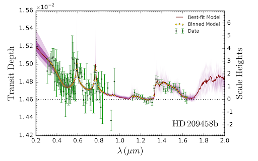

.. _POSEIDON_Papers:

POSEIDON Papers
===============

Each list includes the ADS link, a summary of how POSEIDON was used, an 
indication of who on the paper actually developed/used POSEIDON, and a figure 
for visual reference. Papers are categorised into development and collaboration papers.

.. note:: In preparation! 

Development Papers
------------------

MacDonald & Madhusudhan (2017a)
^^^^^^^^^^^^^^^^^^^^^^^^^^^^^^^
`ADS Link <https://ui.adsabs.harvard.edu/abs/2017MNRAS.469.1979M/abstract>`_

* **Usage**: Introduction of POSEIDON as a 2D atmospheric retrieval algorithm for transmission spectra with generalized inhomogeneous ('patchy') clouds and free chemistry. Applied to the HST transmission spectrum of the hot Jupiter HD 209458b, detecting nitrogen chemistry (NH3/HCN), non-uniform cloud coverage, high-altitude hazes, and sub-solar water.
* **Lead Developer**: Ryan MacDonald

MacDonald & Madhusudhan (2017b)
^^^^^^^^^^^^^^^^^^^^^^^^^^^^^^^
`ADS Link <https://ui.adsabs.harvard.edu/abs/2017ApJ...850L..15M/abstract>`_

.. image:: ../_static/paper_images/MacDonald_Madhu_2017b.png
   :alt: Sample image
   :width: 400px
   :align: center

* **Usage**: POSEIDON used to model transmission spectra of hot Jupiters with differing levels of nitrogen (NH3/HCN) chemistry.
* **Lead Developer**: Ryan MacDonald

Sedaghati (2017)
^^^^^^^^^^^^^^^^
`ADS Link <https://ui.adsabs.harvard.edu/abs/2017Natur.549..238S/abstract>`_

.. image:: ../_static/paper_images/Sedaghati_2017.png
   :alt: Sample image
   :width: 400px
   :align: center

* **Usage**: POSEIDON utilized to detect TiO in the atmosphere of the HST transmission spectrum hot Jupiter WASP-19b, alongside H2O, Na, and a haze.
* **Lead Developer**: Ryan MacDonald

MacDonald & Madhusudhan (2019)
^^^^^^^^^^^^^^^^^^^^^^^^^^^^^^^
`ADS Link <https://ui.adsabs.harvard.edu/abs/2019MNRAS.486.1292M/abstract>`_

.. image:: ../_static/paper_images/MacDonald_Madhu_2019.png
   :alt: Sample image
   :width: 400px
   :align: center

* **Usage**: POSEIDON used to perform atmospheric retrievals of the HST and Spitzer transmission spectrum of exo-Neptune HAT-P-26b. Atmosphere was revealed to be metal-rich with 1.5% H2O, O/H (a proxy for metallicity) 18x solar, C/O < 0.33. Metal hydrides (TiH, CrH, or ScH) were also detected.
* **Lead Developer**: Ryan MacDonald

MacDonald & Goyal & Lewis (2020)
^^^^^^^^^^^^^^^^^^^^^^^^^^^^^^^^^
`ADS Link <https://ui.adsabs.harvard.edu/abs/2020ApJ...893L..43M/abstract>`_

.. image:: ../_static/paper_images/MacDonald_Goyal_Lewis_2020.png
   :alt: Sample image
   :width: 400px
   :align: center

* **Usage**: POSEIDON's multidimensional aspect demonstrated that 1D retrieval analysis of transmission spectra of planets with inhomogeneous morning-evening terminators biases the retrieved temperature to be colder.
* **Lead Developer**: Ryan MacDonald

Kaltenegger & MacDonald (2020)
^^^^^^^^^^^^^^^^^^^^^^^^^^^^^^
`ADS Link <https://ui.adsabs.harvard.edu/abs/2020ApJ...901L...1K/abstract>`_

.. image:: ../_static/paper_images/Kaltenegger_MacDonald_2020.png
   :alt: Sample image
   :width: 400px
   :align: center

* **Usage**: POSEIDON utilized to generate forward model transmission spectra of rocky worlds transiting white dwarfs, create synthetic JWST data, and retrieve posteriors.
* **Lead Developer**: Ryan MacDonald

MacDonald & Lewis (2022)
^^^^^^^^^^^^^^^^^^^^^^^^^
`ADS Link <https://ui.adsabs.harvard.edu/abs/2022ApJ...929...20M/abstract>`_

.. image:: ../_static/paper_images/MacDonald_Lewis_2022.png
   :alt: Sample image
   :width: 400px
   :align: center

* **Usage**: Development of TRIDENT, the 3D radiative transfer module used in POSEIDON’s transmission spectroscopy. Enables full 3D atmospheres, ingress/egress, and grazing transmission spectra.
* **Lead Developer**: Ryan MacDonald

POSEIDON 1.0 Released! (January 2023)
^^^^^^^^^^^^^^^^^^^^^^^^^^^^^^^^^^^^^

* **Lead Developer**: Ryan MacDonald

MacDonald (2023)
^^^^^^^^^^^^^^^^^
`ADS Link <https://ui.adsabs.harvard.edu/abs/2023JOSS....8.4873M/abstract>`_

.. image:: ../_static/paper_images/MacDonald_2023.png
   :alt: Sample image
   :width: 400px
   :align: center

* **Usage**: Journal of Open Source Science (JOSS) paper for POSEIDON.
* **Lead Developer**: Ryan MacDonald

POSEIDON 1.1 Released! (June 2023)
^^^^^^^^^^^^^^^^^^^^^^^^^^^^^^^^^^

* **Lead Developers**:
  - Ryan MacDonald (Stellar Contamination)
  - Ruizhe Wang (Equilibrium Chemistry Grid)
  - Elijah Mullens (Contributor to Equilibrium Chemistry)

Collaboration Papers
--------------------

Lewis et al (2020)
^^^^^^^^^^^^^^^^^^^
`ADS Link <https://ui.adsabs.harvard.edu/abs/2020ApJ...902L..19L/abstract>`_

.. image:: ../_static/paper_images/Lewis_2020.png
   :alt: Sample image
   :width: 400px
   :align: center

* **Usage**: POSEIDON utilized to perform free chemistry retrievals on the hot Jupiter HAT-P-41b’s UV (HST) transmission spectrum, detecting H-.
* **Lead Developer**: Ryan MacDonald

Munazza et al (2021)
^^^^^^^^^^^^^^^^^^^^
`ADS Link <https://ui.adsabs.harvard.edu/abs/2021ApJ...906L..10A/abstract>`_

.. image:: ../_static/paper_images/Munazza_2021.png
   :alt: Sample image
   :width: 400px
   :align: center

* **Usage**: POSEIDON utilized to perform free chemistry retrievals on the hot Jupiter WASP-62b’s HST and Spitzer transmission spectrum, determining it to be cloud-free with a significant detection of Na and a tentative detection of SiH.
* **Lead Developer**: Ryan MacDonald

Kirk et al (2021)
^^^^^^^^^^^^^^^^^
`ADS Link <https://ui.adsabs.harvard.edu/abs/2021AJ....162...34K/abstract>`_

.. image:: ../_static/paper_images/Kirk_2021.png
   :alt: Sample image
   :width: 400px
   :align: center

* **Usage**: POSEIDON used to perform free chemistry retrievals on the ultrahot Jupiter WASP-103b’s ground-based optical + HST and Spitzer infrared transmission spectrum. Findings indicate best explanation involves stellar contamination, with weak evidence of H2O, HCN, and TiO. First paper to use the stellar contamination component of POSEIDON and fit ground-based data.
* **Lead Developer**: Ryan MacDonald

.. note:: The list of papers is not exhaustive and will be updated as more papers are  published. If you have a paper that uses POSEIDON, please let us know!

